<!-- README.md is generated from README.Rmd. Please edit that file -->

# nlmixr2

<!-- badges: start -->

<!-- badges: end -->

The goal of nlmixr2 is to support easy and robust nonlinear mixed
effects models in R

## Installation

The easiest way to install nlmixr2 is to use:

``` r
install.pakcages("nlmixr2")
```

You can install the development version of nlmixr2 and its
nlmixr2-family dependencies like so:

``` r
remotes::install_github("nlmixr2/nlmixr2data")
remotes::install_github("nlmixr2/lotri")
remotes::install_github("nlmixr2/rxode2")
remotes::install_github("nlmixr2/nlmixr2est")
remotes::install_github("nlmixr2/nlmixr2extra")
remotes::install_github("nlmixr2/nlmixr2plot")
remotes::install_github("nlmixr2/nlmixr2")
```

Optional supporting packages can be installed like so:

``` r
remotes::install_github("ggPMXdevelopment/ggPMX") # Goodness of fit plots
remotes::install_github("nlmixr2/xpose.nlmixr") # Additional goodness of fit plots
remotes::install_github("RichardHooijmaijers/shinyMixR") # Shiny run manager (like Piranha)
remotes::install_github("nlmixr2/nlmixr2targets") # Simplify work with the `targets` package
```

## Example

This is a basic example which shows you how to solve a common problem:

``` r
library(nlmixr2)
#> Loading required package: nlmixr2data

## The basic model consiss of an ini block that has initial estimates
one.compartment <- function() {
  ini({
    tka <- 0.45 # Log Ka
    tcl <- 1 # Log Cl
    tv <- 3.45    # Log V
    eta.ka ~ 0.6
    eta.cl ~ 0.3
    eta.v ~ 0.1
    add.sd <- 0.7
  })
  # and a model block with the error sppecification and model specification
  model({
    ka <- exp(tka + eta.ka)
    cl <- exp(tcl + eta.cl)
    v <- exp(tv + eta.v)
    d/dt(depot) = -ka * depot
    d/dt(center) = ka * depot - cl / v * center
    cp = center / v
    cp ~ add(add.sd)
  })
}

## The fit is performed by the function nlmixr/nlmix2 specifying the model, data and estimate
fit <- nlmixr2(one.compartment, theo_sd,  est="saem", saemControl(print=0))
#> ℹ parameter labels from comments will be replaced by 'label()'
#> → loading into symengine environment...
#> → pruning branches (`if`/`else`) of saem model...
#> ✔ done
#> → finding duplicate expressions in saem model...
#> [====|====|====|>---------------------------------]  33%; 0:00:00 [====|====|====|====|====|====|====|====|====|====] 100%; 0:00:00                                                                                  
#> → optimizing duplicate expressions in saem model...
#> [====|====|====|====|====|====|====|====|====|====] 100%; 0:00:00                                                                                  
#> ✔ done
#> rxode2 2.0.7 using 4 threads (see ?getRxThreads)
#> Calculating covariance matrix
#> >-------------------------------------------------]  01%; 0:00:00 [====|====|====|====|====|====|====|====|====|====] 100%; 0:00:00                                                                                  
#> → loading into symengine environment...
#> → pruning branches (`if`/`else`) of saem model...
#> ✔ done
#> → finding duplicate expressions in saem predOnly model 0...
#> [====|====|====|====|====|====|====|====|====|====] 100%; 0:00:00                                                                                  
#> → finding duplicate expressions in saem predOnly model 1...
#> [====|====|====|====|====|====|====|====|====|====] 100%; 0:00:00                                                                                  
#> → optimizing duplicate expressions in saem predOnly model 1...
#> [====|====|====|====|====|====|====|====|====|====] 100%; 0:00:00                                                                                  
#> → finding duplicate expressions in saem predOnly model 2...
#> [====|====|====|====|====|====|====|====|====|====] 100%; 0:00:00                                                                                  
#> ✔ done
#> → Calculating residuals/tables
#> ✔ done
#> → compress origData in nlmixr2 object, save 5952
#> → compress phiM in nlmixr2 object, save 62360
#> → compress parHist in nlmixr2 object, save 9560
#> → compress saem0 in nlmixr2 object, save 24896
print(fit)
#> ── nlmixr SAEM OBJF by FOCEi approximation ──
#> 
#>  Gaussian/Laplacian Likelihoods: AIC() or $objf etc. 
#>  FOCEi CWRES & Likelihoods: addCwres() 
#> 
#> ── Time (sec $time): ──
#> 
#>            setup covariance  saem table compress    other
#> elapsed 0.001155   0.007006 2.164  0.02    0.019 1.435839
#> 
#> ── Population Parameters ($parFixed or $parFixedDf): ──
#> 
#>        Parameter  Est.     SE %RSE Back-transformed(95%CI) BSV(CV%) Shrink(SD)%
#> tka       Log Ka 0.454  0.196 43.1       1.57 (1.07, 2.31)     71.5   -0.0203% 
#> tcl       Log Cl  1.02 0.0853  8.4       2.76 (2.34, 3.26)     27.6      3.46% 
#> tv         Log V  3.45 0.0454 1.32       31.5 (28.8, 34.4)     13.4      9.89% 
#> add.sd           0.693                               0.693                     
#>  
#>   Covariance Type ($covMethod): linFim
#>   No correlations in between subject variability (BSV) matrix
#>   Full BSV covariance ($omega) or correlation ($omegaR; diagonals=SDs) 
#>   Distribution stats (mean/skewness/kurtosis/p-value) available in $shrink 
#> 
#> ── Fit Data (object is a modified tibble): ──
#> # A tibble: 132 × 19
#>   ID     TIME    DV  PRED    RES IPRED   IRES  IWRES eta.ka eta.cl   eta.v    cp
#>   <fct> <dbl> <dbl> <dbl>  <dbl> <dbl>  <dbl>  <dbl>  <dbl>  <dbl>   <dbl> <dbl>
#> 1 1      0     0.74  0     0.74   0     0.74   1.07   0.103 -0.491 -0.0820  0   
#> 2 1      0.25  2.84  3.27 -0.426  3.87 -1.03  -1.48   0.103 -0.491 -0.0820  3.87
#> 3 1      0.57  6.57  5.85  0.723  6.82 -0.246 -0.356  0.103 -0.491 -0.0820  6.82
#> # … with 129 more rows, and 7 more variables: depot <dbl>, center <dbl>,
#> #   ka <dbl>, cl <dbl>, v <dbl>, tad <dbl>, dosenum <dbl>
```

# Default plots

``` r
plot(fit)
```

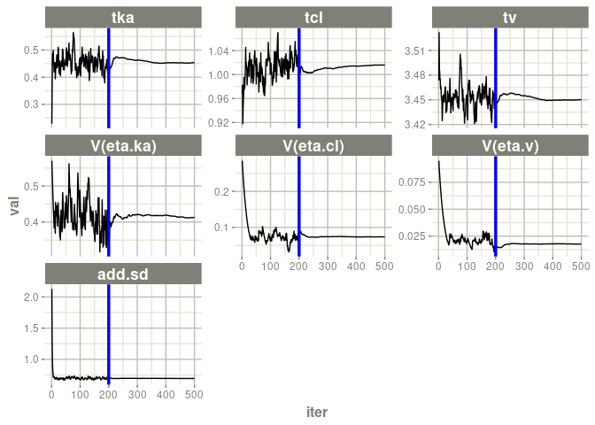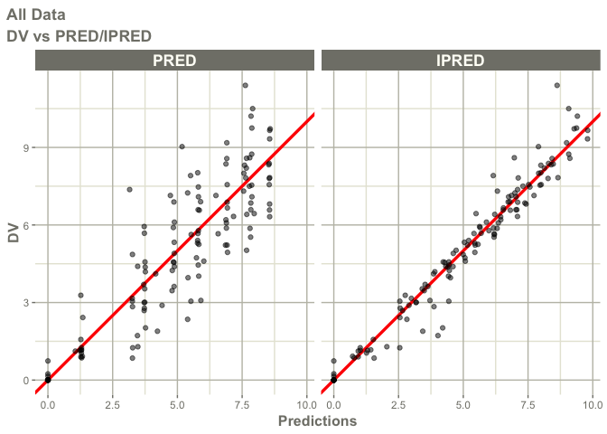

    #> Warning: Transformation introduced infinite values in continuous x-axis
    #> Warning: Transformation introduced infinite values in continuous y-axis

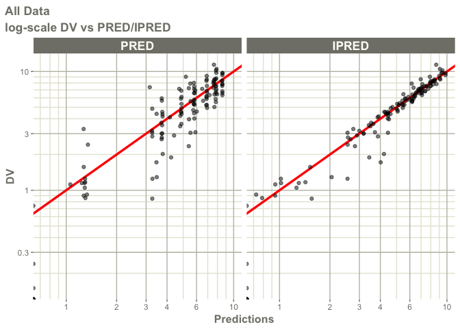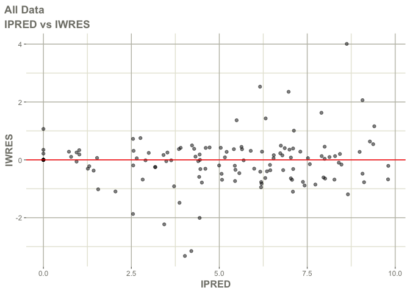

    #> Warning: Transformation introduced infinite values in continuous x-axis

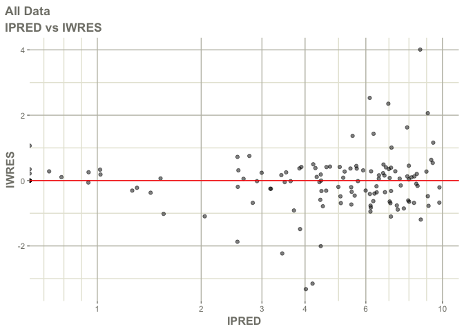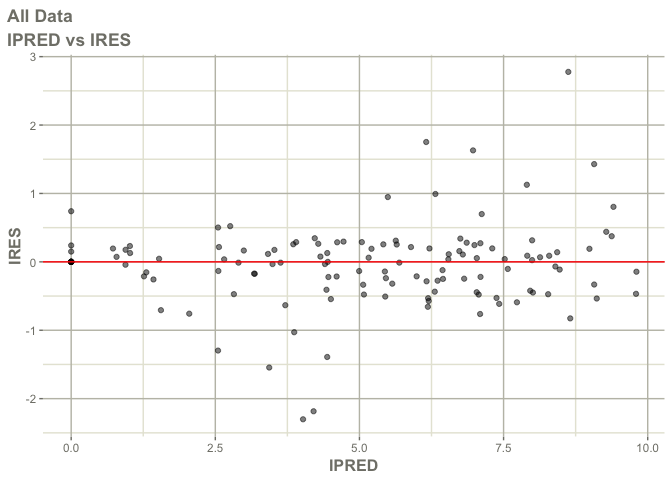

    #> Warning: Transformation introduced infinite values in continuous x-axis

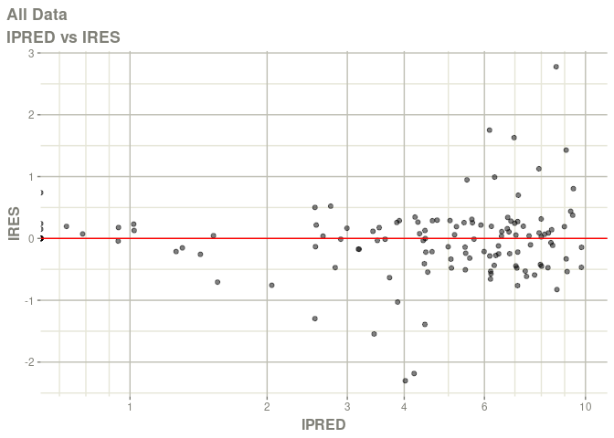

    #> Warning: Transformation introduced infinite values in continuous x-axis

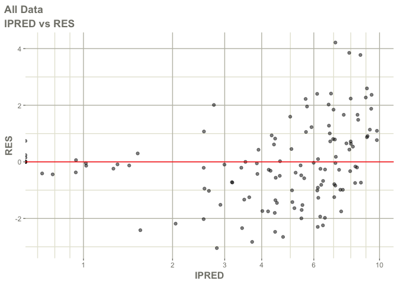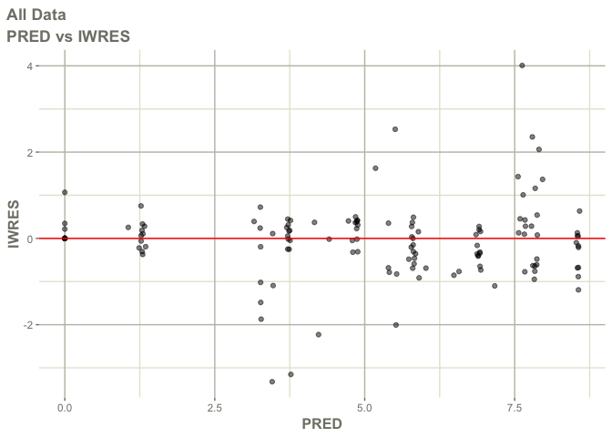

    #> Warning: Transformation introduced infinite values in continuous x-axis

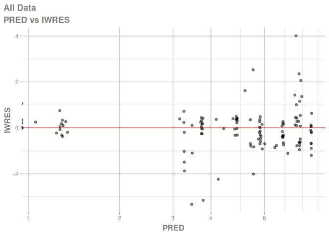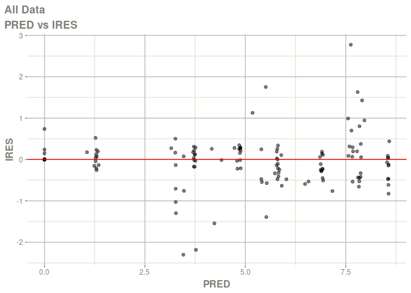

    #> Warning: Transformation introduced infinite values in continuous x-axis

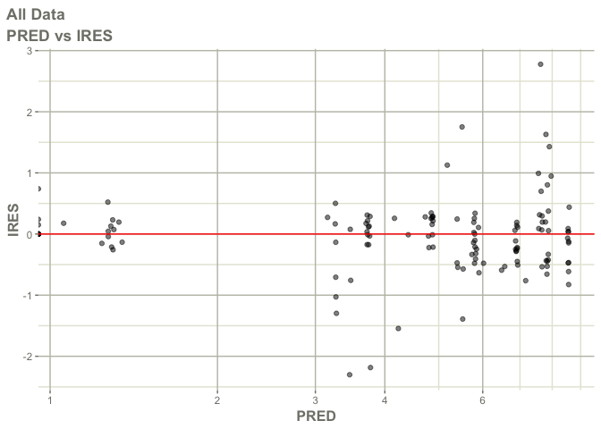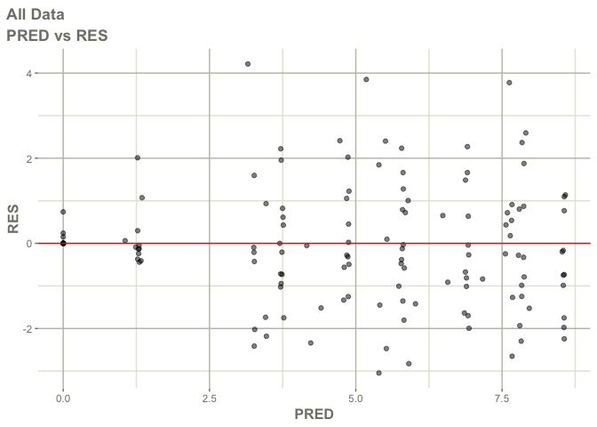

    #> Warning: Transformation introduced infinite values in continuous x-axis

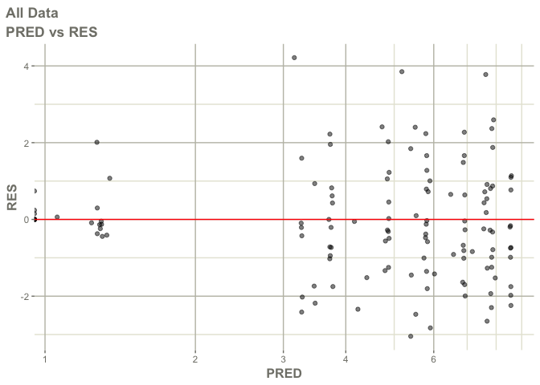

    #> Warning: Transformation introduced infinite values in continuous x-axis

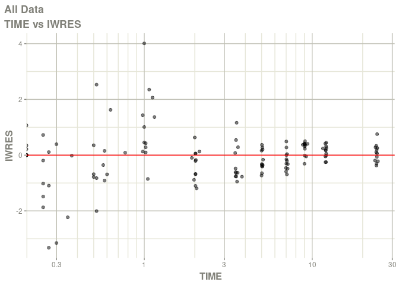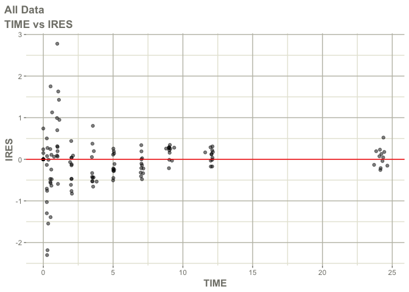

    #> Warning: Transformation introduced infinite values in continuous x-axis

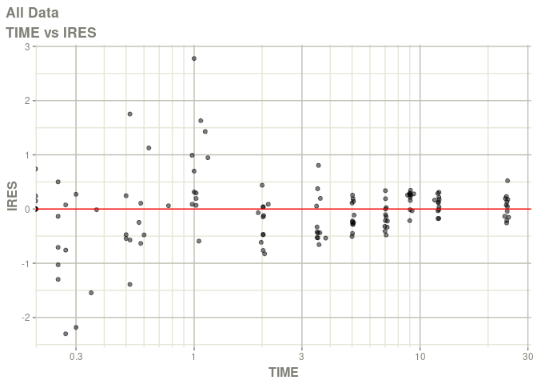

    #> Warning: Transformation introduced infinite values in continuous x-axis

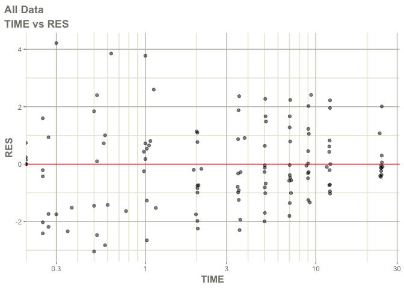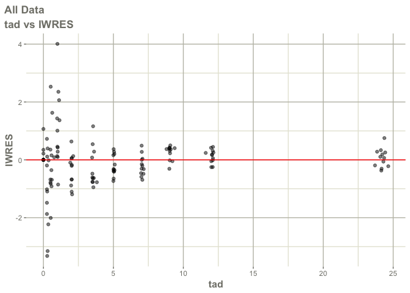

    #> Warning: Transformation introduced infinite values in continuous x-axis

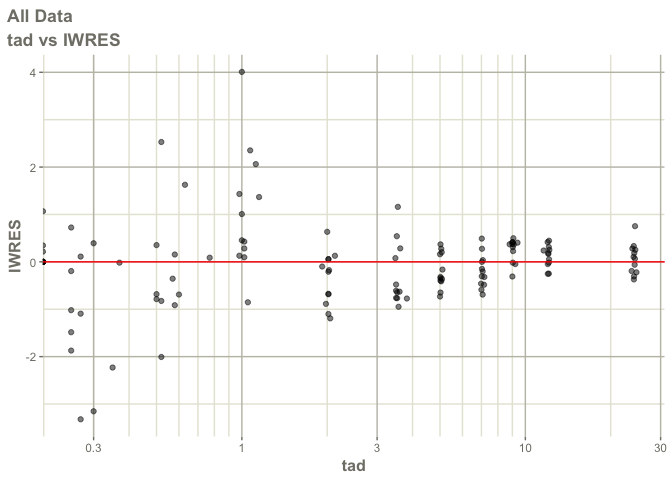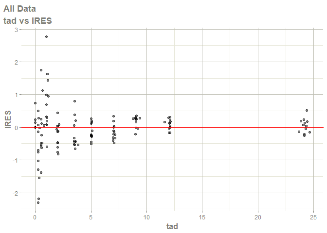

    #> Warning: Transformation introduced infinite values in continuous x-axis

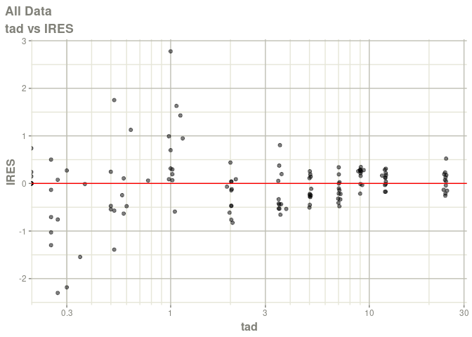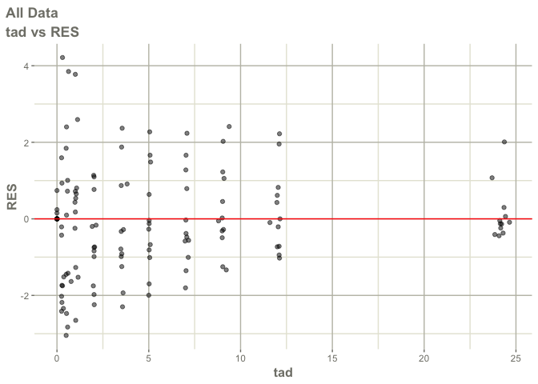

    #> Warning: Transformation introduced infinite values in continuous x-axis

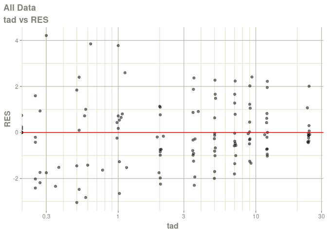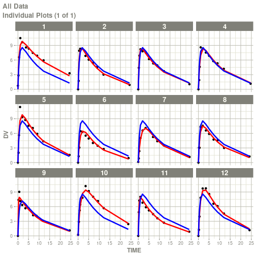
