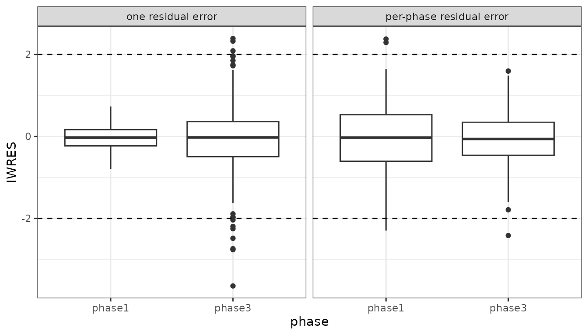

# Fitting separate phase 1 and phase 3 residual error


nlmixr

## One structural model, two residual error models

A pooled population PK analysis usually combines studies that were not
run under the same conditions. Phase 1 contributes rich profiles from
healthy volunteers at one site, with a validated assay and controlled
sample handling. Phase 3 contributes sparse samples from patients across
many sites, with nominal rather than recorded times and more variable
sample handling.

The drug does not change between the phases, so the structural model
does not either. What changes is the *noise around the prediction*.
Forcing one residual error model onto the pooled data splits the
difference: it overstates the noise on the phase 1 records and
understates it on the phase 3 ones. Because the residual variance is
what weights each observation in the objective function, that compromise
leaks into the structural and random-effect estimates too.

`rxode2` lets one prediction carry more than one residual error model,
each named with `| <name>`:

``` r

library(nlmixr2)
library(ggplot2)

pkPhase <- function() {
  ini({
    tka <- 0.45; label("Log Ka")
    tcl <- 1;    label("Log Cl")
    tv  <- 3.45; label("Log V")
    eta.ka ~ 0.6
    eta.cl ~ 0.3
    eta.v  ~ 0.1
    phase1.sd <- 0.3; label("Phase 1 additive error (mg/L)")
    phase3.sd <- 0.3; label("Phase 3 additive error (mg/L)")
  })
  model({
    ka <- exp(tka + eta.ka)
    cl <- exp(tcl + eta.cl)
    v  <- exp(tv + eta.v)
    d/dt(depot)  <- -ka * depot
    d/dt(center) <-  ka * depot - cl / v * center
    cp <- center / v
    cp ~ add(phase1.sd) | phase1
    cp ~ add(phase3.sd) | phase3
  })
}
```

There is one `cp` and one set of ODEs. Which standard deviation applies
is decided per observation record, by the compartment (or `dvid`) that
record names:

``` r

pkPhase()$multipleEndpoint
#>   variable                   cmt                   dvid*
#> 1   cp ~ … cmt='phase1' or cmt=3 dvid='phase1' or dvid=1
#> 2   cp ~ … cmt='phase3' or cmt=4 dvid='phase3' or dvid=2
```

This is the estimation companion to the `rxode2` article [Separating
phase 1 and phase 3 residual
error](https://nlmixr2.github.io/rxode2/articles/rxode2-phase-residual-error.html),
which covers the same model from the simulation side.

### A pooled dataset

To make the point visible we simulate a pooled analysis dataset where
the two phases really do have different residual error – phase 1 at
`0.15 mg/L`, phase 3 at `0.8 mg/L` – and then try to recover it.

``` r

sim <- pkPhase() |>
  ini(phase1.sd = 0.15, phase3.sd = 0.8)

# phase 1: 12 subjects, rich sampling
ev1 <- et(amt=320, cmt="depot") |>
  et(c(0.25, 0.5, 1, 2, 3, 4, 6, 8, 12, 16, 24), cmt="phase1")

# phase 3: 48 subjects, sparse sampling
ev3 <- et(amt=320, cmt="depot") |>
  et(c(1, 4, 12, 24), cmt="phase3")

set.seed(42)
d1 <- rxSolve(sim, ev1, nSub=12, addDosing=TRUE, returnType="data.frame")
d3 <- rxSolve(sim, ev3, nSub=48, addDosing=TRUE, returnType="data.frame")

# label each study's observation records with its phase, and keep the
# subject ids distinct between the two
d1$dvid <- ifelse(d1$evid == 0, "phase1", NA_character_)
d3$dvid <- ifelse(d3$evid == 0, "phase3", NA_character_)
d3$sim.id <- d3$sim.id + max(d1$sim.id)

dat <- rbind(d1, d3)
dat$DV <- dat$sim
dat <- dat[, c("sim.id", "time", "amt", "evid", "DV", "dvid")]
names(dat) <- c("ID", "TIME", "AMT", "EVID", "DV", "dvid")

head(dat)
#>   ID TIME AMT EVID       DV   dvid
#> 1  1 0.00 320    1       NA   <NA>
#> 2  1 0.25  NA    0 2.050783 phase1
#> 3  1 0.50  NA    0 3.410563 phase1
#> 4  1 1.00  NA    0 4.697256 phase1
#> 5  1 2.00  NA    0 5.267174 phase1
#> 6  1 3.00  NA    0 4.995577 phase1
table(dat$dvid, useNA="no")
#> 
#> phase1 phase3 
#>    132    192
```

The residual standard deviations really are different in this dataset:

``` r

c(phase1 = sd(d1$sim - d1$ipredSim, na.rm=TRUE),
  phase3 = sd(d3$sim - d3$ipredSim, na.rm=TRUE))
#>    phase1    phase3 
#> 0.1679217 0.7474359
```

The `dvid` column is what selects the endpoint. It can equally be a
`cmt` column, or the numeric `dvid` that `$multipleEndpoint` lists;
dosing records leave it missing.

### What one residual error model gives you

First fit the same structural model with a single additive error, on the
same data with the `dvid` column removed:

``` r

pkPooled <- function() {
  ini({
    tka <- 0.45; label("Log Ka")
    tcl <- 1;    label("Log Cl")
    tv  <- 3.45; label("Log V")
    eta.ka ~ 0.6
    eta.cl ~ 0.3
    eta.v  ~ 0.1
    add.sd <- 0.3; label("Pooled additive error (mg/L)")
  })
  model({
    ka <- exp(tka + eta.ka)
    cl <- exp(tcl + eta.cl)
    v  <- exp(tv + eta.v)
    d/dt(depot)  <- -ka * depot
    d/dt(center) <-  ka * depot - cl / v * center
    cp <- center / v
    cp ~ add(add.sd)
  })
}

datPooled <- dat[, names(dat) != "dvid"]

fitPooled := nlmixr2(pkPooled, datPooled, est="focei",
                     control=list(print=0))

fitPooled$parFixedDf["add.sd", c("Estimate", "SE", "Back-transformed")]
#>         Estimate          SE Back-transformed
#> add.sd 0.5160063 0.005750164        0.5160063
```

The single estimate lands between the two truths. Nothing in the output
says so – the fit converges and the parameter has a small standard error
– but the conditional weighted residuals do:

``` r

resPooled <- as.data.frame(fitPooled)
resPooled$phase <- dat$dvid[dat$EVID == 0]

tapply(resPooled$IWRES, resPooled$phase, sd)
#>    phase1    phase3 
#> 0.3007890 0.9484509
```

Individual weighted residuals should have about the same spread in every
stratum. Splitting them by phase shows they do not: phase 3 supplies
most of the records, so it pulls the single `add.sd` towards its own
error and ends up reasonably weighted, while the phase 1 records – whose
true error is five times smaller – are divided by a standard deviation
far too large for them and are effectively discounted in the objective
function.

### Fitting both at once

The two-endpoint model needs no extra machinery – give
[`nlmixr2()`](https://nlmixr2.github.io/nlmixr2est/reference/nlmixr2.html)
the dataset with its `dvid` column:

``` r

fitPhase := nlmixr2(pkPhase, dat, est="focei",
                    control=list(print=0))

print(fitPhase)
#> ── nlmixr² FOCEi (outer: bobyqa) ──
#> 
#>           OBJF      AIC      BIC Log-likelihood Condition#(Cov) Condition#(Cor)
#> FOCEi 272.1228 883.5949 913.8409      -433.7975        2616.107        139.7353
#> 
#> ── Time (sec $time): ──
#> 
#>            setup  optimize covariance preprocess postprocess table compress
#> elapsed 2.669604 0.7785523   1.506586      0.036       0.015 0.046    0.001
#>             other
#> elapsed 0.1782578
#> 
#> ── Population Parameters ($parFixed or $parFixedDf): ──
#> 
#>                               Parameter  Est.     SE %RSE
#> tka                              Log Ka 0.317  0.105 33.3
#> tcl                              Log Cl 0.952 0.0760 7.99
#> tv                                Log V  3.51 0.0454 1.29
#> phase1.sd Phase 1 additive error (mg/L) 0.169 0.0146 8.64
#> phase3.sd Phase 3 additive error (mg/L) 0.841 0.0492 5.85
#>           Back-transformed(95%CI) BSV(CV%) Shrink(SD)%
#> tka             1.37 (1.12, 1.69)     66.1       18.6 
#> tcl             2.59 (2.23, 3.01)     60.6       6.72 
#> tv              33.5 (30.7, 36.7)     33.5       10.5 
#> phase1.sd    0.169 (0.140, 0.197)                     
#> phase3.sd    0.841 (0.744, 0.937)                     
#>  
#>   Covariance Type ($covMethod): r,s
#>   Some strong fixed parameter correlations exist ($cor) :
#>                 cor:tcl,tka              cor:tv,tka       cor:phase1.sd,tka 
#>                 -0.890                   0.321                   0.197   
#>       cor:phase3.sd,tka       cor:om.eta.ka,tka       cor:om.eta.cl,tka 
#>                  0.164                    0.173                    0.897  
#>        cor:om.eta.v,tka              cor:tv,tcl       cor:phase1.sd,tcl 
#>                  0.553                  -0.329                 -0.0826   
#>       cor:phase3.sd,tcl       cor:om.eta.ka,tcl       cor:om.eta.cl,tcl 
#>                 -0.238                  -0.0186                   -0.701  
#>        cor:om.eta.v,tcl        cor:phase1.sd,tv        cor:phase3.sd,tv 
#>                 -0.609                 -0.0872                    0.271   
#>        cor:om.eta.ka,tv        cor:om.eta.cl,tv         cor:om.eta.v,tv 
#>                  0.266                    0.304                   0.426  
#> cor:phase3.sd,phase1.sd cor:om.eta.ka,phase1.sd cor:om.eta.cl,phase1.sd 
#>                  0.155                  -0.0141                    0.201   
#>  cor:om.eta.v,phase1.sd cor:om.eta.ka,phase3.sd cor:om.eta.cl,phase3.sd 
#>                 0.0555                    0.209                    0.247   
#>  cor:om.eta.v,phase3.sd cor:om.eta.cl,om.eta.ka  cor:om.eta.v,om.eta.ka 
#>                  0.386                   0.291                    0.585  
#>  cor:om.eta.v,om.eta.cl 
#>                  0.514  
#>  
#> 
#>   No correlations in between subject variability (BSV) matrix
#>   Full BSV covariance ($omega) or correlation ($omegaR; diagonals=SDs) 
#>   Distribution stats (mean/skewness/kurtosis/p-value) available in $shrink 
#>   Information about run found ($runInfo):
#>    • gradient problems with covariance; see $scaleInfo 
#>    • using S matrix to calculate covariance, can check sandwich or R matrix with $covRS and $covR 
#>    • last objective function was not at minimum, possible problems in optimization 
#>    • ETAs were reset to zero during optimization; (Can control by foceiControl(resetEtaP=.)) 
#>    • initial ETAs were nudged; (can control by foceiControl(etaNudge=., etaNudge2=)) 
#>   Censoring ($censInformation): No censoring
#>   Minimization message ($message):  
#>     Normal exit from bobyqa 
#> 
#> ── Fit Data (object is a modified tibble): ──
#> # A tibble: 324 × 24
#>   ID     TIME CMT       DV  PRED    RES   WRES IPRED    IRES  IWRES CPRED   CRES
#>   <fct> <dbl> <chr>  <dbl> <dbl>  <dbl>  <dbl> <dbl>   <dbl>  <dbl> <dbl>  <dbl>
#> 1 1      0.25 phase1  2.05  2.74 -0.693 -0.419  2.09 -0.0419 -0.249  2.68 -0.627
#> 2 1      0.5  phase1  3.41  4.64 -1.23  -0.502  3.39  0.0177  0.105  4.50 -1.09 
#> 3 1      1    phase1  4.70  6.80 -2.10  -0.740  4.68  0.0222  0.132  6.53 -1.83 
#> # ℹ 321 more rows
#> # ℹ 12 more variables: CWRES <dbl>, eta.ka <dbl>, eta.cl <dbl>, eta.v <dbl>,
#> #   depot <dbl>, center <dbl>, ka <dbl>, cl <dbl>, v <dbl>, cp <dbl>,
#> #   tad <dbl>, dosenum <int>
```

``` r

fitPhase$parFixedDf[c("phase1.sd", "phase3.sd"),
                    c("Estimate", "SE", "Back-transformed")]
#>            Estimate         SE Back-transformed
#> phase1.sd 0.1685220 0.01455884        0.1685220
#> phase3.sd 0.8406829 0.04921878        0.8406829
```

Both standard deviations come back near the values used to simulate. The
weighted residuals are now on a comparable scale in the two phases,
instead of differing by a factor of three:

``` r

resPhase <- as.data.frame(fitPhase)
resPhase$phase <- dat$dvid[dat$EVID == 0]

tapply(resPhase$IWRES, resPhase$phase, sd)
#>    phase1    phase3 
#> 0.8518591 0.6725491
```

Neither reaches exactly 1, and that is expected: the phase 3 design has
four samples per subject against three random effects, so its individual
estimates – and with them its IWRES – are shrunk. What matters is that
the two strata are no longer weighted against each other.

``` r

d <- rbind(
  data.frame(model="one residual error",  phase=resPooled$phase, iwres=resPooled$IWRES),
  data.frame(model="per-phase residual error", phase=resPhase$phase, iwres=resPhase$IWRES))

ggplot(d, aes(x=phase, y=iwres)) +
  geom_boxplot() +
  geom_hline(yintercept=c(-2, 2), linetype="dashed") +
  facet_wrap(~model) +
  ylab("IWRES") +
  theme_bw()
```



The two fits are nested – the pooled model is the per-phase model with
the two standard deviations constrained equal – so the objective
functions are comparable on one degree of freedom:

``` r

c(pooled = fitPooled$objf, perPhase = fitPhase$objf)
#>   pooled perPhase 
#> 444.5732 272.1228
c(pooled = AIC(fitPooled),  perPhase = AIC(fitPhase))
#>    pooled  perPhase 
#> 1054.0454  883.5949
```

### Working with the model

Because both endpoints have the same left-hand side, model piping has to
be told which one you mean. Name the condition:

``` r

pkPhase2 <- pkPhase() |>
  model(cp ~ prop(phase3.prop) | phase3)

print(pkPhase2)
#>  ── rxode2-based free-form 2-cmt ODE model ────────────────────────────────────── 
#>  ── Initalization: ──  
#> Fixed Effects ($theta): 
#>         tka         tcl          tv   phase1.sd phase3.prop 
#>        0.45        1.00        3.45        0.30        1.00 
#> 
#> Omega ($omega): 
#>        eta.ka eta.cl eta.v
#> eta.ka    0.6    0.0   0.0
#> eta.cl    0.0    0.3   0.0
#> eta.v     0.0    0.0   0.1
#> 
#> States ($state or $stateDf): 
#>   Compartment Number Compartment Name
#> 1                  1            depot
#> 2                  2           center
#>  ── Multiple Endpoint Model ($multipleEndpoint): ──  
#>   variable                   cmt                   dvid*
#> 1   cp ~ … cmt='phase1' or cmt=3 dvid='phase1' or dvid=1
#> 2   cp ~ … cmt='phase3' or cmt=4 dvid='phase3' or dvid=2
#>   * If dvids are outside this range, all dvids are re-numered sequentially, ie 1,7, 10 becomes 1,2,3 etc
#> 
#>  ── μ-referencing ($muRefTable): ──  
#>   theta    eta level
#> 1   tka eta.ka    id
#> 2   tcl eta.cl    id
#> 3    tv  eta.v    id
#> 
#>  ── Model (Normalized Syntax): ── 
#> function() {
#>     ini({
#>         tka <- 0.45
#>         label("Log Ka")
#>         tcl <- 1
#>         label("Log Cl")
#>         tv <- 3.45
#>         label("Log V")
#>         phase1.sd <- c(0, 0.3)
#>         label("Phase 1 additive error (mg/L)")
#>         phase3.prop <- c(0, 1)
#>         eta.ka ~ 0.6
#>         eta.cl ~ 0.3
#>         eta.v ~ 0.1
#>     })
#>     model({
#>         ka <- exp(tka + eta.ka)
#>         cl <- exp(tcl + eta.cl)
#>         v <- exp(tv + eta.v)
#>         d/dt(depot) <- -ka * depot
#>         d/dt(center) <- ka * depot - cl/v * center
#>         cp <- center/v
#>         cp ~ add(phase1.sd) | phase1
#>         cp ~ prop(phase3.prop) | phase3
#>     })
#> }
```

Piping `cp ~ prop(phase3.prop)` with no `| phase3` reports the
conditions to choose from rather than guessing. The same name removes
one endpoint:

``` r

pkPhase3 <- pkPhase2 |>
  model(-phase3)

print(pkPhase3)
#>  ── rxode2-based free-form 2-cmt ODE model ────────────────────────────────────── 
#>  ── Initalization: ──  
#> Fixed Effects ($theta): 
#>       tka       tcl        tv phase1.sd 
#>      0.45      1.00      3.45      0.30 
#> 
#> Omega ($omega): 
#>        eta.ka eta.cl eta.v
#> eta.ka    0.6    0.0   0.0
#> eta.cl    0.0    0.3   0.0
#> eta.v     0.0    0.0   0.1
#> 
#> States ($state or $stateDf): 
#>   Compartment Number Compartment Name
#> 1                  1            depot
#> 2                  2           center
#>  ── μ-referencing ($muRefTable): ──  
#>   theta    eta level
#> 1   tka eta.ka    id
#> 2   tcl eta.cl    id
#> 3    tv  eta.v    id
#> 
#>  ── Model (Normalized Syntax): ── 
#> function() {
#>     ini({
#>         tka <- 0.45
#>         label("Log Ka")
#>         tcl <- 1
#>         label("Log Cl")
#>         tv <- 3.45
#>         label("Log V")
#>         phase1.sd <- c(0, 0.3)
#>         label("Phase 1 additive error (mg/L)")
#>         eta.ka ~ 0.6
#>         eta.cl ~ 0.3
#>         eta.v ~ 0.1
#>     })
#>     model({
#>         ka <- exp(tka + eta.ka)
#>         cl <- exp(tcl + eta.cl)
#>         v <- exp(tv + eta.v)
#>         d/dt(depot) <- -ka * depot
#>         d/dt(center) <- ka * depot - cl/v * center
#>         cp <- center/v
#>         cp ~ add(phase1.sd) | phase1
#>     })
#> }
```

Each endpoint has to be named. Two unnamed endpoints on one variable
(`cp ~ add(a)` written twice) are rejected when the model is built,
because no data record could tell them apart.

Transformations are per endpoint too, so
`cp ~ lnorm(phase3.sd) | phase3` gives phase 3 a log-normal residual
while phase 1 stays additive, and the same is true of
[`boxCox()`](https://nlmixr2.github.io/nlmixr2est/reference/boxCox.html),
`propT()`, `combined1` and the rest.

### Notes

- The endpoints share `cp`, so they share every structural parameter and
  every random effect. This is a residual-error split, not a separate
  model per phase; if the phases need different clearance or absorption,
  that belongs in a covariate on `cl` or `ka`.
- `rxode2` gives each of the shared endpoints its own generated variable
  (`rx.cp.phase1`, `rx.cp.phase3`, listed in `$endpointAlias`), which is
  why `$predDf$var` differs from the variable you typed. It is internal;
  you never write those lines and they do not appear in the fit.
- The same pattern applies to any grouping the residual error depends on
  and the structural model does not: assay version, sample matrix
  (plasma versus dried blood spot), or site.
- All estimation methods handle it – `focei`, `saem`, `nlme` and the
  `nlm` family all read the per-endpoint residual parameters.
