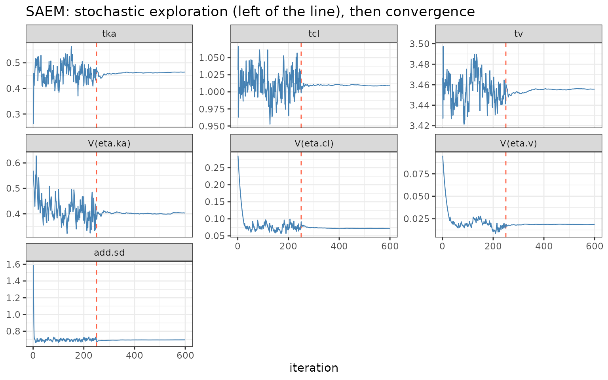

# SAEM in nlmixr2: robust stochastic-approximation EM


nlmixr

## SAEM (`est = "saem"`): the robust stochastic EM

`est = "saem"` is nlmixr2’s **Stochastic Approximation
Expectation-Maximization** method (Kuhn & Lavielle 2005), and – with
`focei` – one of the two workhorses. Where the [conditional-estimation
ladder](https://nlmixr2.github.io/nlmixr2/articles/linearized-quadrature-ladder.md)
approximates the marginal likelihood analytically (a Laplace-type
expansion), SAEM sidesteps that approximation entirely: it draws the
random effects with **MCMC** and updates the population parameters by
**stochastic approximation**. That makes it exceptionally robust – it
keeps working on nonlinear models, mixtures, and awkward posteriors
where a Laplace approximation is unreliable or an optimizer gets stuck.

This article leads with a worked example; the algorithm follows.

## Worked example: watch it converge, and check it against FOCEI

The theophylline model, one compartment, between-subject variability on
`ka`, `cl` and `v`:

``` r

library(nlmixr2)

theoModel <- function() {
  ini({
    tka <- 0.45; tcl <- 1; tv <- 3.45
    eta.ka ~ 0.6; eta.cl ~ 0.3; eta.v ~ 0.1
    add.sd <- 0.7
  })
  model({
    ka <- exp(tka + eta.ka)
    cl <- exp(tcl + eta.cl)
    v  <- exp(tv  + eta.v)
    d/dt(depot)  <- -ka * depot
    d/dt(center) <-  ka * depot - cl / v * center
    cp <- center / v
    cp ~ add(add.sd)
  })
}
```

[`saemControl()`](https://nlmixr2.github.io/nlmixr2est/reference/saemControl.html)
sets the two phases of the run explicitly: `nBurn` **exploratory**
iterations (a constant, large stochastic step that lets the chain roam),
then `nEm` **convergence** iterations (a shrinking Robbins-Monro step
that averages the noise away):

``` r

fitSaem  := nlmixr2(theoModel, nlmixr2data::theo_sd, est = "saem",
                    control = saemControl(nBurn = 250L, nEm = 350L, print = 0L))
fitFocei := nlmixr2(theoModel, nlmixr2data::theo_sd, est = "focei",
                    control = foceiControl(print = 0L))
```

### The signature SAEM convergence trajectory

The whole parameter history is stored in the fit. Plotting it shows
SAEM’s two phases unmistakably – noisy exploration up to `nBurn`, then a
smooth settle:

``` r

library(ggplot2)

nBurn <- 250
ph <- fitSaem$parHistData
keep <- c("tka", "tcl", "tv", "V(eta.ka)", "V(eta.cl)", "V(eta.v)", "add.sd")
long <- do.call(rbind, lapply(keep, function(p)
  data.frame(iter = ph$iter, parameter = p, value = ph[[p]])))
long$parameter <- factor(long$parameter, levels = keep)

ggplot(long, aes(iter, value)) +
  geom_vline(xintercept = nBurn, linetype = 2, colour = "tomato") +
  geom_line(linewidth = 0.4, colour = "steelblue") +
  facet_wrap(~ parameter, scales = "free_y") +
  labs(x = "iteration", y = NULL,
       title = "SAEM: stochastic exploration (left of the line), then convergence") +
  theme_bw()
```



Left of the red line the chain explores; right of it the decreasing step
size drives it to the maximum-likelihood estimate. Watching this plot is
the standard way to judge SAEM convergence – if the right-hand phase has
not flattened, increase `nEm`.

### It agrees with FOCEI

On a model where FOCEI’s Laplace approximation is accurate, SAEM lands
in the same place – a reassuring cross-check from a completely different
estimation principle:

``` r

round(rbind(FOCEI = fitFocei$theta, SAEM = fitSaem$theta), 3)
#>         tka   tcl    tv add.sd
#> FOCEI 0.463 1.012 3.460  0.694
#> SAEM  0.464 1.009 3.456  0.697
round(rbind(FOCEI = diag(fitFocei$omega), SAEM = diag(fitSaem$omega)), 3)
#>       eta.ka eta.cl eta.v
#> FOCEI  0.400  0.069 0.019
#> SAEM   0.403  0.071 0.019
```

A note on the objective: SAEM’s reported `-2LL` is computed by a
**separate** likelihood step (importance sampling or Gaussian
quadrature) with its own constant convention, so it is **not** directly
comparable to a FOCEI or IMP objective. Compare SAEM to SAEM.

## When to choose SAEM

Reach for `saem` when:

- the model is **strongly nonlinear** or the individual posteriors are
  **non-Gaussian**, so a Laplace approximation (FOCEI/`laplace`) may be
  biased – SAEM makes no such approximation;
- you are fitting a **mixture model** (distinct subpopulations); SAEM’s
  MCMC E-step handles the discrete mixture indicator naturally (see the
  [mixture-models
  article](https://nlmixr2.github.io/nlmixr2/articles/mixture-models.md));
- an optimizer-based method **fails to converge** or is sensitive to
  starting values – SAEM’s stochastic exploration is far less prone to
  getting stuck;
- you have **many random effects** or a complex covariance structure,
  where the robustness of the stochastic E-step pays off.

Prefer **FOCEI** when the model is close to linear and you want the
fastest deterministic fit with an immediately comparable objective
function; use the [importance-sampling EM
family](https://nlmixr2.github.io/nlmixr2/articles/imp-impmap-qrpem.md)
when you specifically need a Monte-Carlo *exact marginal likelihood*
(SAEM does not return one directly).

## How SAEM works

SAEM is an EM algorithm whose E-step is done by simulation. Each
iteration:

- **Simulation (stochastic E-step).** Rather than integrate the random
  effects out analytically, SAEM samples them: a Metropolis-Hastings
  chain draws each subject’s `eta` from its conditional posterior
  `p(eta | y_i, theta)` at the current parameters. No linearization, no
  Laplace expansion.
- **Stochastic approximation.** The complete-data sufficient statistics
  are updated as a running average with step size `gamma_k`. During
  **burn-in** (`k <= nBurn`) `gamma_k = 1`, so the statistics track the
  exploring chain; during **convergence** (`k > nBurn`) `gamma_k`
  decreases (Robbins-Monro), averaging out the Monte-Carlo noise so the
  estimates settle.
- **Maximization (M-step).** Given the (approximate) sufficient
  statistics, the population parameters – typical values, `Omega`,
  residual error – have closed-form updates for mu-referenced models,
  which is what makes each iteration cheap.

Two practical consequences: the objective is **not** produced by the
algorithm itself (nlmixr2 computes the `-2LL` afterward, by importance
sampling or Gaussian quadrature), and the fit is **stochastic** –
reproducible for a fixed seed, but you should confirm convergence from
the trajectory rather than from a single objective value.

### The same idea, a different implementation: babelmixr2 `saemix`

`babelmixr2` exposes a second SAEM through `est = "saemix"`, which runs
the **`saemix`** R package (Comets, Lavielle & Kuhn) on the same nlmixr2
model and wraps the result as an nlmixr2 fit. Because both implement the
same algorithm, `saemix` is a natural independent cross-check of an
`est = "saem"` run:

``` r

library(babelmixr2)
fitSaemix <- nlmixr2(theoModel, nlmixr2data::theo_sd, est = "saemix",
                     control = saemixControl())
```

## How it relates to the other methods

|  | FOCEI / laplace / agq | **SAEM** | imp / impmap / qrpem |
|----|----|----|----|
| Marginal likelihood | Analytic approximation | **Not used during fitting** (MCMC E-step) | Monte-Carlo (near-exact) |
| E-step | Conditional mode | **MCMC sampling** | Importance sampling |
| Robustness on hard/multimodal models | Lower | **High** | Medium |
| Objective for model comparison | Directly | Separate step, own constant | Directly (matches NONMEM IMP) |
| External equivalents | NONMEM FOCE(I); Phoenix FOCE | **NONMEM SAEM; Monolix; saemix** | NONMEM IMP/IMPMAP; Phoenix QRPEM |

`est = "saem"` corresponds to the SAEM in NONMEM (`METHOD=SAEM`),
Monolix (whose engine is SAEM), and the `saemix` package – all the same
Kuhn-Lavielle algorithm. It is the robust, approximation-free member of
the nlmixr2 estimation family, complementary to FOCEI’s speed and the
importance-sampling family’s exact likelihood.

## References

- Kuhn E, Lavielle M. *Maximum likelihood estimation in nonlinear mixed
  effects models.* Computational Statistics & Data Analysis, 2005.
- Delyon B, Lavielle M, Moulines E. *Convergence of a stochastic
  approximation version of the EM algorithm.* Annals of Statistics,
  1999.
- Comets E, Lavielle M, Kuhn E. *saemix: an R version of the SAEM
  algorithm.* (the `saemix` package, exposed via `babelmixr2`).
