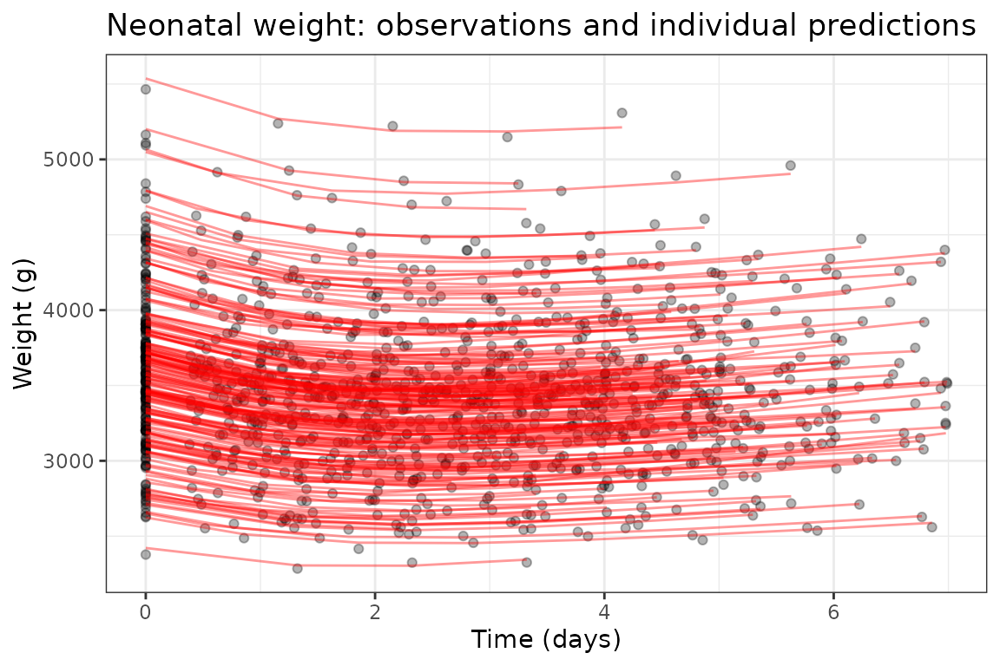

# VAE-NLME -- neonatal weight growth with automatic covariate selection


nlmixr

## The variational autoencoder estimation method (`est = "vae"`)

`nlmixr2` includes a variational-autoencoder estimator for nonlinear
mixed-effects models, `est = "vae"`. It is a native reimplementation of
the VAE-NLME method of Rohleff et al. (2025), which performs
**simultaneous population-parameter estimation and covariate selection**
in a single training run. Instead of an outer optimizer over the
population parameters, an amortized encoder learns each subject’s
individual parameters directly from that subject’s observations, and the
population parameters are refreshed by a stochastic-approximation M-step
that also decides – automatically – which covariates belong in the
model.

This article reproduces **Case Study 2** from that paper: a neonatal
weight-growth model fit to 189 neonates, where the method is expected to
discover that **gestational age (GA) drives birth weight**.

## The data

The `neonatal_wt` data set (from `nlmixr2data`) holds serial weight
measurements on 189 neonates together with five candidate subject-level
covariates: sex, delivery mode (`DelM`), gestational age (`GA`),
maternal age (`Mage`) and parity (`Para2`). This data was included in
the original python implementation and is an open source simulated
dataset.

``` r

library(nlmixr2)

neonatal <- nlmixr2data::neonatal_wt
head(neonatal)
#>   ID  TIME       DV EVID Sex DelM       GA    Mage Para2
#> 1  1 0.000 3101.359    0   0    1 39.77217 28.4113     0
#> 2  1 0.583 3010.934    0   0    1 39.77217 28.4113     0
#> 3  1 1.583 2883.217    0   0    1 39.77217 28.4113     0
#> 4  1 2.583 3019.272    0   0    1 39.77217 28.4113     0
#> 5  1 3.583 2983.498    0   0    1 39.77217 28.4113     0
#> 6  1 4.583 3077.099    0   0    1 39.77217 28.4113     0
```

`DV` is body weight (grams) over `TIME` (days). The covariates are
constant within a subject, so the VAE treats them as candidate
predictors of the individual growth parameters.

## The model

The growth of weight `W` follows a turnover model: a logistic-gated
production term `kprod` and a saturable elimination term `kelim`, with
the birth weight `W0` as the initial condition. There are five
log-linked structural parameters (`W0`, `kin`, `TL`, `koutmax`, `T50`),
each with a random effect, and a combined additive + proportional error
model.

``` r

neonatalModel <- function() {
  ini({
    lW0      <- log(3000)
    lkin     <- log(30)
    lTL      <- log(2)
    lkoutmax <- log(0.05)
    lT50     <- log(1)
    eta.W0      ~ 0.001
    eta.kin     ~ 0.01
    eta.TL      ~ 0.05
    eta.koutmax ~ 0.05
    eta.T50     ~ 0.05
    add.err  <- 30
    prop.err <- 0.02
  })
  model({
    W0      <- exp(lW0 + eta.W0)
    kin     <- exp(lkin + eta.kin)
    TL      <- exp(lTL + eta.TL)
    koutmax <- exp(lkoutmax + eta.koutmax)
    T50     <- exp(lT50 + eta.T50)
    kprod   <- kin * expit(2 * (t - TL))
    kelim   <- koutmax * (1 - t / (T50 + t))
    d/dt(W) <- kprod - kelim * W
    W(0)    <- W0
    W ~ add(add.err) + prop(prop.err)
  })
}
```

We do **not** put any covariate on any parameter: `est = "vae"` searches
the five candidate covariates against all five parameters on its own.

## Fitting with `est = "vae"`

The control settings below are deliberately small so the demonstration
runs quickly (this is a cached example – see *Contributing a
long-running example* for how the `:=` cache works); production runs
would use the defaults (`itersBurnIn = 100`, `iters = 300`). `sigma0`
seeds the encoder’s initial posterior standard deviations for the five
parameters.

``` r

ctl <- vaeControl(itersBurnIn = 60L, iters = 120L, klWarmup = 40L,
                  gammaIter = 90L, nGradStep = 4L, print = 0L,
                  covariateSelection = TRUE,
                  sigma0 = c(1e-3, 1e-2, 1e-1, 1e-1, 1e-1))

fit := nlmixr2(neonatalModel, neonatal, est = "vae", control = ctl)

print(fit)
#> ── nlmixr² vae ──
#> 
#>           OBJF      AIC      BIC Log-likelihood Condition#(Cov) Condition#(Cor)
#> FOCEi 10812.25 12900.67 12975.98      -6435.334       689215624        1321.413
#> FOCE  10821.03 12909.45 12984.76      -6439.724       689215624        1321.413
#> 
#> ── Time (sec $time): ──
#> 
#>            setup  optimize covariance preprocess postprocess table compress
#> elapsed 7.013313 0.0307196   20.47759      0.074       0.054 0.162    0.008
#> 
#> ── Population Parameters ($parFixed or $parFixedDf): ──
#> 
#>                 Est.      SE    %RSE   Back-transformed(95%CI) BSV(CV%)
#> lW0             8.18 5.30e-4 0.00648         3580 (3580, 3580)     12.7
#> lkin            4.50  0.0237   0.527         89.9 (85.8, 94.2)     19.3
#> lTL            0.512  0.0287    5.59         1.67 (1.58, 1.77)     13.1
#> lkoutmax       -2.65  0.0299    1.12   0.0703 (0.0663, 0.0745)     10.0
#> lT50          0.0202  0.0807     399        1.02 (0.871, 1.20)     15.5
#> add.err         18.0    3.11    17.3         18.0 (11.9, 24.1)         
#> prop.err     0.00993 5.56e-4    5.60 0.00993 (0.00884, 0.0110)         
#> beta_lW0_SEX  0.0899 4.82e-4   0.536   0.0899 (0.0890, 0.0909)         
#> beta_lW0_GA     1.86  0.0115   0.620         1.86 (1.84, 1.88)         
#> beta_lkin_GA    1.88   0.289    15.4         1.88 (1.31, 2.45)         
#>              Shrink(SD)%
#> lW0               0.169 
#> lkin               31.6 
#> lTL                74.8 
#> lkoutmax           52.2 
#> lT50               60.2 
#> add.err                 
#> prop.err                
#> beta_lW0_SEX            
#> beta_lW0_GA             
#> beta_lkin_GA            
#>  
#>   Covariance Type ($covMethod): |r|,|s|
#>   Some strong fixed parameter correlations exist ($cor) :
#>                        cor:lkin,lW0                     cor:lTL,lW0 
#>                         0.0432                            0.172   
#>                cor:lkoutmax,lW0                    cor:lT50,lW0 
#>                          0.405                          -0.257   
#>                 cor:add.err,lW0                cor:prop.err,lW0 
#>                          0.107                           -0.301  
#>            cor:beta_lW0_SEX,lW0             cor:beta_lW0_GA,lW0 
#>                      -0.000381                           -0.142   
#>            cor:beta_lkin_GA,lW0               cor:om.eta.W0,lW0 
#>                          0.168                           -0.172   
#>              cor:om.eta.kin,lW0               cor:om.eta.TL,lW0 
#>                         0.0969                           0.0409   
#>          cor:om.eta.koutmax,lW0              cor:om.eta.T50,lW0 
#>                         0.0559                           0.0175   
#>                    cor:lTL,lkin               cor:lkoutmax,lkin 
#>                          0.297                           -0.476  
#>                   cor:lT50,lkin                cor:add.err,lkin 
#>                          0.691                         -0.0434   
#>               cor:prop.err,lkin           cor:beta_lW0_SEX,lkin 
#>                         0.0277                            0.135   
#>            cor:beta_lW0_GA,lkin           cor:beta_lkin_GA,lkin 
#>                          0.137                          -0.0474   
#>              cor:om.eta.W0,lkin             cor:om.eta.kin,lkin 
#>                          0.142                           -0.232   
#>              cor:om.eta.TL,lkin         cor:om.eta.koutmax,lkin 
#>                         -0.421                          -0.140   
#>             cor:om.eta.T50,lkin                cor:lkoutmax,lTL 
#>                        -0.0166                           -0.298   
#>                    cor:lT50,lTL                 cor:add.err,lTL 
#>                          0.143                           0.0567   
#>                cor:prop.err,lTL            cor:beta_lW0_SEX,lTL 
#>                        0.00906                          -0.0164   
#>             cor:beta_lW0_GA,lTL            cor:beta_lkin_GA,lTL 
#>                         0.0265                           -0.131   
#>               cor:om.eta.W0,lTL              cor:om.eta.kin,lTL 
#>                          0.188                            0.118   
#>               cor:om.eta.TL,lTL          cor:om.eta.koutmax,lTL 
#>                         -0.354                           0.117   
#>              cor:om.eta.T50,lTL               cor:lT50,lkoutmax 
#>                          0.149                           -0.927  
#>            cor:add.err,lkoutmax           cor:prop.err,lkoutmax 
#>                          0.123                          -0.0458   
#>       cor:beta_lW0_SEX,lkoutmax        cor:beta_lW0_GA,lkoutmax 
#>                        -0.0631                           -0.342  
#>       cor:beta_lkin_GA,lkoutmax          cor:om.eta.W0,lkoutmax 
#>                          0.324                          -0.224   
#>         cor:om.eta.kin,lkoutmax          cor:om.eta.TL,lkoutmax 
#>                          0.493                           0.607  
#>     cor:om.eta.koutmax,lkoutmax         cor:om.eta.T50,lkoutmax 
#>                          0.459                           0.389  
#>                cor:add.err,lT50               cor:prop.err,lT50 
#>                         -0.127                           0.0297   
#>           cor:beta_lW0_SEX,lT50            cor:beta_lW0_GA,lT50 
#>                         0.0918                            0.328  
#>           cor:beta_lkin_GA,lT50              cor:om.eta.W0,lT50 
#>                         -0.270                            0.187   
#>             cor:om.eta.kin,lT50              cor:om.eta.TL,lT50 
#>                         -0.520                          -0.569  
#>         cor:om.eta.koutmax,lT50             cor:om.eta.T50,lT50 
#>                         -0.457                          -0.373  
#>            cor:prop.err,add.err        cor:beta_lW0_SEX,add.err 
#>                         -0.832                           0.133   
#>         cor:beta_lW0_GA,add.err        cor:beta_lkin_GA,add.err 
#>                          0.312                          -0.208   
#>           cor:om.eta.W0,add.err          cor:om.eta.kin,add.err 
#>                        -0.0372                            0.137   
#>           cor:om.eta.TL,add.err      cor:om.eta.koutmax,add.err 
#>                         0.0136                           0.0634   
#>          cor:om.eta.T50,add.err       cor:beta_lW0_SEX,prop.err 
#>                         0.0409                           -0.196   
#>        cor:beta_lW0_GA,prop.err       cor:beta_lkin_GA,prop.err 
#>                         -0.352                           0.167   
#>          cor:om.eta.W0,prop.err         cor:om.eta.kin,prop.err 
#>                          0.151                            0.177   
#>          cor:om.eta.TL,prop.err     cor:om.eta.koutmax,prop.err 
#>                          0.248                            0.269   
#>         cor:om.eta.T50,prop.err    cor:beta_lW0_GA,beta_lW0_SEX 
#>                          0.284                           0.0614   
#>   cor:beta_lkin_GA,beta_lW0_SEX      cor:om.eta.W0,beta_lW0_SEX 
#>                          0.106                          -0.0906   
#>     cor:om.eta.kin,beta_lW0_SEX      cor:om.eta.TL,beta_lW0_SEX 
#>                         0.0301                          -0.0236   
#> cor:om.eta.koutmax,beta_lW0_SEX     cor:om.eta.T50,beta_lW0_SEX 
#>                        -0.0220                           0.0287   
#>    cor:beta_lkin_GA,beta_lW0_GA       cor:om.eta.W0,beta_lW0_GA 
#>                         -0.746                         -0.0193   
#>      cor:om.eta.kin,beta_lW0_GA       cor:om.eta.TL,beta_lW0_GA 
#>                         -0.190                           -0.306  
#>  cor:om.eta.koutmax,beta_lW0_GA      cor:om.eta.T50,beta_lW0_GA 
#>                         -0.293                           -0.314  
#>      cor:om.eta.W0,beta_lkin_GA     cor:om.eta.kin,beta_lkin_GA 
#>                        -0.0649                            0.123   
#>      cor:om.eta.TL,beta_lkin_GA cor:om.eta.koutmax,beta_lkin_GA 
#>                          0.319                           0.241   
#>     cor:om.eta.T50,beta_lkin_GA        cor:om.eta.kin,om.eta.W0 
#>                          0.309                         -0.0766   
#>         cor:om.eta.TL,om.eta.W0    cor:om.eta.koutmax,om.eta.W0 
#>                         -0.154                          -0.0882   
#>        cor:om.eta.T50,om.eta.W0        cor:om.eta.TL,om.eta.kin 
#>                        -0.0670                            0.791  
#>   cor:om.eta.koutmax,om.eta.kin       cor:om.eta.T50,om.eta.kin 
#>                          0.854                           0.895  
#>    cor:om.eta.koutmax,om.eta.TL        cor:om.eta.T50,om.eta.TL 
#>                          0.793                           0.777  
#>   cor:om.eta.T50,om.eta.koutmax 
#>                          0.947  
#>  
#> 
#>   No correlations in between subject variability (BSV) matrix
#>   Full BSV covariance ($omega) or correlation ($omegaR; diagonals=SDs) 
#>   Distribution stats (mean/skewness/kurtosis/p-value) available in $shrink 
#>   Information about run found ($runInfo):
#>    • gradient problems with covariance; see $scaleInfo 
#>    • since sandwich matrix is corrected, you may compare to $covR or $covS if you wish 
#>    • S matrix non-positive definite but corrected by S = sqrtm(S%*%S) 
#>    • R matrix non-positive definite but corrected by R = sqrtm(R%*%R) 
#>    • encoder: small parallel deviation; parEncoderBackward=FALSE turns off 
#>   Censoring ($censInformation): No censoring
#>   Minimization message ($message):  
#>     Likelihood evaluation with provided ETAs 
#> 
#> ── Fit Data (object is a modified tibble): ──
#> # A tibble: 1,120 × 27
#>   ID     TIME    DV  PRED   RES   WRES IPRED   IRES  IWRES CPRED  CRES  CWRES
#>   <fct> <dbl> <dbl> <dbl> <dbl>  <dbl> <dbl>  <dbl>  <dbl> <dbl> <dbl>  <dbl>
#> 1 1     0     3101. 3437. -336. -0.771 3106.  -4.66 -0.131 3421. -320. -0.811
#> 2 1     0.583 3011. 3331. -320. -0.758 3015.  -3.77 -0.108 3315. -304. -0.797
#> 3 1     1.58  2883. 3240. -356. -0.873 2943. -59.7  -1.74  3225. -342. -0.923
#> # ℹ 1,117 more rows
#> # ℹ 15 more variables: eta.W0 <dbl>, eta.kin <dbl>, eta.TL <dbl>,
#> #   eta.koutmax <dbl>, eta.T50 <dbl>, W <dbl>, W0 <dbl>, kin <dbl>, TL <dbl>,
#> #   koutmax <dbl>, T50 <dbl>, kprod <dbl>, kelim <dbl>, GA <dbl>, SEX <int>
```

## The result: covariate selection

The selected covariate effects are injected directly into the fitted
model, so they appear in the parameter table just like any
hand-specified effect. The canonical result for this case study is a
**gestational-age effect on birth weight**, which shows up as a
coefficient on the `lW0` line.

Injected coefficients are named `beta.<parameter>.<COVARIATE>.<shape>`,
so `beta.lW0.GA.power` is the `power`-shaped `GA` effect on `lW0`. The
name tells you which parameter carries the effect, which data column it
came from, and the functional form it was written in – all three matter
when you compare coefficients between runs.

``` r

# the fitted, covariate-augmented model -- note the centered covariate term
print(fit$ui)
#>  ── rxode2-based free-form 1-cmt ODE model ────────────────────────────────────── 
#>  ── Initalization: ──  
#> Fixed Effects ($theta): 
#>          lW0         lkin          lTL     lkoutmax         lT50      add.err 
#>  8.182930493  4.498658110  0.512124480 -2.654852628  0.020230587 17.971475528 
#>     prop.err beta_lW0_SEX  beta_lW0_GA beta_lkin_GA 
#>  0.009926208  0.089932758  1.858021667  1.880300012 
#> 
#> Omega ($omega): 
#>                 eta.W0    eta.kin     eta.TL eta.koutmax    eta.T50
#> eta.W0      0.01594505 0.00000000 0.00000000 0.000000000 0.00000000
#> eta.kin     0.00000000 0.03674796 0.00000000 0.000000000 0.00000000
#> eta.TL      0.00000000 0.00000000 0.01705157 0.000000000 0.00000000
#> eta.koutmax 0.00000000 0.00000000 0.00000000 0.009944432 0.00000000
#> eta.T50     0.00000000 0.00000000 0.00000000 0.000000000 0.02387728
#> 
#> States ($state or $stateDf): 
#>   Compartment Number Compartment Name
#> 1                  1                W
#>  ── μ-referencing ($muRefTable): ──  
#>      theta         eta level
#> 1      lW0      eta.W0    id
#> 2     lkin     eta.kin    id
#> 3      lTL      eta.TL    id
#> 4 lkoutmax eta.koutmax    id
#> 5     lT50     eta.T50    id
#>                                                                      covariates
#> 1 log(0.0251816572108206 * GA)*beta_lW0_GA + -0.481481481481 + SEX*beta_lW0_SEX
#> 2                                     log(0.0251816572108206 * GA)*beta_lkin_GA
#> 3                                                                              
#> 4                                                                              
#> 5                                                                              
#> 
#>  ── Model (Normalized Syntax): ── 
#> function() {
#>     ini({
#>         lW0 <- 8.18293049253
#>         lkin <- 4.49865811027
#>         lTL <- 0.512124479978
#>         lkoutmax <- -2.65485262837
#>         lT50 <- 0.020230587301
#>         add.err <- c(0, 17.9714755277)
#>         prop.err <- c(0, 0.00992620770633)
#>         beta_lW0_SEX <- 0.0899327583251
#>         beta_lW0_GA <- 1.85802166713
#>         beta_lkin_GA <- 1.88030001206
#>         eta.W0 ~ 0.0159450547485
#>         eta.kin ~ 0.0367479615613
#>         eta.TL ~ 0.0170515722265
#>         eta.koutmax ~ 0.00994443162136
#>         eta.T50 ~ 0.0238772782812
#>     })
#>     model({
#>         W0 <- exp(lW0 + beta_lW0_SEX * (SEX - 0.481481481481) + 
#>             beta_lW0_GA * log(GA/39.7114451852) + eta.W0)
#>         kin <- exp(lkin + beta_lkin_GA * log(GA/39.7114451852) + 
#>             eta.kin)
#>         TL <- exp(lTL + eta.TL)
#>         koutmax <- exp(lkoutmax + eta.koutmax)
#>         T50 <- exp(lT50 + eta.T50)
#>         kprod <- kin * expit(2 * (t - TL), 0, 1)
#>         kelim <- koutmax * (1 - t/(T50 + t))
#>         d/dt(W) <- kprod - kelim * W
#>         W(0) <- W0
#>         W ~ add(add.err) + prop(prop.err)
#>     })
#> }

# the fixed-effect table, including any selected covariate coefficients
fit$parFixed
#>                 Est.      SE    %RSE   Back-transformed(95%CI) BSV(CV%)
#> lW0             8.18 5.30e-4 0.00648         3580 (3580, 3580)     12.7
#> lkin            4.50  0.0237   0.527         89.9 (85.8, 94.2)     19.3
#> lTL            0.512  0.0287    5.59         1.67 (1.58, 1.77)     13.1
#> lkoutmax       -2.65  0.0299    1.12   0.0703 (0.0663, 0.0745)     10.0
#> lT50          0.0202  0.0807     399        1.02 (0.871, 1.20)     15.5
#> add.err         18.0    3.11    17.3         18.0 (11.9, 24.1)         
#> prop.err     0.00993 5.56e-4    5.60 0.00993 (0.00884, 0.0110)         
#> beta_lW0_SEX  0.0899 4.82e-4   0.536   0.0899 (0.0890, 0.0909)         
#> beta_lW0_GA     1.86  0.0115   0.620         1.86 (1.84, 1.88)         
#> beta_lkin_GA    1.88   0.289    15.4         1.88 (1.31, 2.45)         
#>              Shrink(SD)%
#> lW0               0.169<
#> lkin               31.6>
#> lTL                74.8>
#> lkoutmax           52.2>
#> lT50               60.2>
#> add.err                 
#> prop.err                
#> beta_lW0_SEX            
#> beta_lW0_GA             
#> beta_lkin_GA
```

A positive `GA` coefficient means heavier birth weights at higher
gestational age – the expected physiological relationship, recovered
automatically without specifying it up front.

With the settings above the search keeps **three** effects, not just
that one (see *Objective – a deliberate deviation from the reference* in
the appendix for the one place `nlmixr2` departs from the paper, and why
it is not what drives this table):

| effect         | estimate |
|----------------|----------|
| `GA` on `lW0`  | 1.858    |
| `GA` on `lkin` | 1.880    |
| `SEX` on `lW0` | 0.090    |

so gestational age is retained on birth weight *and* on the production
rate `kin`, plus a small sex effect on birth weight. The `lW0`/`GA` term
is the headline result – the canonical finding, recovered as expected –
but do not read the search as returning only that: it returns a
covariate *set*, and every coefficient in it cleared the `log(N)` BICc
penalty.

**The paper’s covariate set is not a comparison target for this fit.**
The data used here –
[`nlmixr2data::neonatal_wt`](https://nlmixr2.github.io/nlmixr2data/reference/neonatal_wt.html)
– is the *simulated* 189-neonate dataset distributed with the reference
implementation, which ships simulated data because the real cohort
cannot be shared. The published Case Study 2 results come from the real
cohort of N = 2425. Comparing a selected covariate set across those two
datasets is not meaningful, so this article does not do it, and neither
should you: the effects recovered here describe this simulated dataset.

The `lW0`/`GA` term is the headline result and the one that reproduces
the canonical finding. The remaining terms cleared the `log(N)` BICc
penalty on this data; treat them as a property of the simulated set
rather than as a claim about neonatal physiology.

## How covariates are handled

It is worth knowing what the search actually considers, because that
determines both what it can find and what a coefficient means.

### Which data columns become candidates

Every column that is not a reserved one (`ID`, `TIME`, `DV`, `AMT`,
`EVID` and friends) is examined, and a column qualifies only if it is

- **subject-constant** – the effect is absorbed as a subject-level
  shift, so a time-varying column cannot be searched;
- **complete and finite** for every subject – the M-step is a
  least-squares fit with no imputation, and the written model has no
  guard to carry an imputed value to solve time; and
- **not a single repeated value**, which would duplicate the intercept.

Anything excluded is reported in `$runInfo` rather than dropped
silently.
[`vaeCovariates()`](https://nlmixr2.github.io/nlmixr2est/reference/vaeCovariates.html)
shows the whole candidate set without running a fit:

``` r

vaeCovariates(neonatal)
#>         covariate   raw     shape level group block cluster        type
#> 1             SEX   SEX       cat  <NA>     1     1       1 categorical
#> 2            DELM  DELM       cat  <NA>     2     2       2 categorical
#> 3        GA_power    GA     power  <NA>     3     3       3  continuous
#> 4          GA_lin    GA       lin  <NA>     3     4       3  continuous
#> 5    GA_hockeyLow    GA hockeyLow  <NA>     3     5       3  continuous
#> 6     GA_hockeyHi    GA  hockeyHi  <NA>     3     5       3  continuous
#> 7      MAGE_power  MAGE     power  <NA>     4     6       4  continuous
#> 8        MAGE_lin  MAGE       lin  <NA>     4     7       4  continuous
#> 9  MAGE_hockeyLow  MAGE hockeyLow  <NA>     4     8       4  continuous
#> 10  MAGE_hockeyHi  MAGE  hockeyHi  <NA>     4     8       4  continuous
#> 11          PARA2 PARA2       cat  <NA>     5     9       5 categorical
#>      center
#> 1   0.00000
#> 2   0.00000
#> 3  39.83230
#> 4  39.83230
#> 5  39.83230
#> 6  39.83230
#> 7  30.40922
#> 8  30.40922
#> 9  30.40922
#> 10 30.40922
#> 11  0.00000
```

Each **row is one search column**, not one covariate. A continuous
covariate contributes several columns – one per functional form it is
allowed to take – and a categorical one contributes an indicator per
level.

### The three kinds of covariate

- **Continuous** (more than two distinct values) is **centered** on its
  population value, which keeps the structural parameter interpretable
  as the typical-subject value. The centering statistic is the
  **median** by default.
- **Categorical** enters as one `0`/`1` indicator per level, with the
  *modal* level as reference. A level held by fewer than `catCutoff` of
  the subjects is lumped into the reference rather than given its own
  coefficient (it would be fit on too few subjects); those are listed in
  `$runInfo`.
- **A bare `0`/`1` indicator column** (such as `sex`, `DelM` or `Para2`
  here) is already in its natural parameterization, so it is left alone
  – it enters as `beta * COV`, its coefficient is the level-1 shift, and
  the structural parameter stays the reference (`COV = 0`) value.

### Shapes: the functional forms a continuous covariate may take

`shapes=` controls which parameterizations the search may try, using the
same vocabulary as `nlmixr2scm::runSCM()`. With `ctr` the centering
value:

[TABLE]

All six are searched by default.

Two things follow from this table. First, the selection objective is a
least-squares fit with a free intercept, so it only sees the **span** of
a column: `"power"` and `"log"` describe the same model, as do `"lin"`,
`"identity"` and `"center"`. Within such a group the shape decides only
how an accepted effect is *written back*, and the one you list **first**
in `shapes=` wins. Second, **at most one shape of a covariate may enter
a given parameter** – you never get two competing parameterizations of
the same covariate on one line.

`"hockey"` is the exception to the first point: it spans a strictly
larger model than the straight-line shapes, because its two arms bend at
the knot instead of sharing one slope. It is **continuous** at the knot
– both arms vanish there, so the structural parameter still means the
value at `ctr` – and both arms enter or neither does. It costs two
coefficients where a linear shape costs one, so the BICc penalty only
takes it when the bend genuinely earns its keep; a covariate whose
effect really is a straight line comes back as `"lin"`. If fewer than
`catCutoff` of the subjects fall on one side of the knot, hockey is
skipped for that covariate with a note in `$runInfo` – normally
unreachable, since the median splits the subjects in half by
construction.

### How a covariate is chosen

Every candidate column is scored by an L0-penalized least-squares fit of
the encoder’s latent posterior means, with a `log(N)` (BICc) penalty
**per coefficient**. A covariate therefore has to improve the fit by
more than it costs, which is what lets the method reject a spurious
effect instead of force-fitting it – and what makes hockey’s second
coefficient a real hurdle rather than a free upgrade.

### When covariates are colinear, or parameters are correlated

Covariate selection gets harder in two situations that are the norm
rather than the exception in pharmacometrics: **candidate covariates
that are correlated with one another** (weight, lean body mass, BSA and
BMI all measure much the same thing), and **individual parameters that
are correlated with one another** (clearance and volume routinely are).
Both push the method toward selecting a covariate that is not the one
actually driving the parameter.

It is worth being precise about why, because the obvious explanation is
the wrong one.

#### It is not a search failure

The natural guess is that the search never looked at the other
covariate. It did. The exact branch-and-bound enumerates every feasible
subset, and the `L0Learn` path re-scores its proposals and then runs an
add / drop / swap local search to convergence. Swapping weight for lean
body mass is a move both engines already consider and score.

The difficulty is the **criterion**, not the search. The selection
regresses the encoder’s latent posterior means on the candidate columns,
so

- the sample size is the number of **subjects**, not observations –
  often a few dozen; and
- the response is an **estimate that moves**, refreshed by the encoder
  at every training iteration.

When two columns correlate at 0.98, the difference in fit between them
is smaller than the iteration-to-iteration movement of the thing being
fitted. The exact minimizer of a noisy criterion is still
near-arbitrary, and it changes its mind from one iteration to the next.
Optimizing harder cannot fix that.

#### Colinearity clusters

Covariates that are near-interchangeable are grouped into a
**colinearity cluster** when their absolute correlation reaches
`covSelectColinearCut` (default `0.9`). Clustering happens at the level
of the *covariate*, not the search column, so the alternate **shapes**
of one covariate are never clustered with each other – those are
competing parameterizations of a single covariate and are already
arbitrated by the rule that at most one shape may enter a parameter.

[`vaeCovariates()`](https://nlmixr2.github.io/nlmixr2est/reference/vaeCovariates.html)
shows the clusters straight from the data, with no fit:

``` r

vaeCovariates(neonatal)[, c("covariate", "group", "block", "cluster")]
#>         covariate group block cluster
#> 1             SEX     1     1       1
#> 2            DELM     2     2       2
#> 3        GA_power     3     3       3
#> 4          GA_lin     3     4       3
#> 5    GA_hockeyLow     3     5       3
#> 6     GA_hockeyHi     3     5       3
#> 7      MAGE_power     4     6       4
#> 8        MAGE_lin     4     7       4
#> 9  MAGE_hockeyLow     4     8       4
#> 10  MAGE_hockeyHi     4     8       4
#> 11          PARA2     5     9       5
```

On this data every candidate ends up in its own cluster – the strongest
cross-covariate correlation among the neonatal covariates is about
`0.2`, so nothing is close to interchangeable and none of the machinery
below engages. A `cluster` column that merges two `group`s is the signal
that it will.

The cluster is built from the **correlation of the subject-level
values** – the same one-row-per-subject design the M-step regresses on.
You can reproduce it without a fit by correlating the candidate columns:

``` r

cand <- vaeCovariates(neonatal)
cols <- names(neonatal)[match(unique(cand$raw), toupper(names(neonatal)))]
round(cor(neonatal[!duplicated(neonatal$ID), cols]), 2)
#>         Sex  DelM    GA  Mage Para2
#> Sex    1.00  0.04 -0.05 -0.13  0.09
#> DelM   0.04  1.00  0.20  0.00 -0.07
#> GA    -0.05  0.20  1.00 -0.13  0.10
#> Mage  -0.13  0.00 -0.13  1.00  0.01
#> Para2  0.09 -0.07  0.10  0.01  1.00
```

Every off-diagonal is well under the `0.9` cut, which is why `cluster`
repeats `group` above. Two covariates whose subject-level values really
are near-interchangeable – weight and lean body mass at `0.98`, say –
would share one `cluster` id instead, and the machinery below would then
treat them as substitutes rather than quietly selecting one and leaving
the other unremarked.

A cluster is a **label, never a constraint**. It does not stop two
correlated covariates from both being selected, and it does not change
the objective. It only tells the two mechanisms below which covariates
are substitutes for one another.

#### Stability: not changing your mind without a reason

Within a cluster, the covariate selected on the previous iteration is
not displaced by a mate unless that mate beats it by
`covSelectHysteresis` (default `0.25`), measured in units of the
`log(N)` selection penalty. A challenger that wins by less than a
quarter of one covariate’s BIC cost has not really won, and the
incumbent stays.

The tolerance is in penalty units rather than as a percentage of the
objective on purpose: the objective grows with the number of subjects
while the decision scale does not, so a percentage would quietly mean
something different in every study.

The effect is that a run settles on an answer instead of alternating
between two equally good ones – which also makes the reported result
reproducible.

#### Saying so when the choice was close

Stability is not the same as being right. When the data genuinely cannot
distinguish two covariates, what you want is to be **told**, not to be
handed one of them with no indication that the other was equally good.

Cluster mates that scored within `covSelectAltTol` (default `0.10`
penalty units) of the selected covariate are recorded on the fit:

``` r

fit$vae$colinear$alternates
#>    param covariate alternate  delta
#> 1 eta.cl  WT_power LBM_power  0.031
```

and a one-line note appears in `$runInfo`. Read that table as: *this
analysis selected weight, but lean body mass fit essentially as well,
and the data does not support preferring one over the other.* That is a
statement worth having before a covariate goes into a final model.

Nothing is reported when nothing is close, so the table staying empty is
informative too.

#### Correlated parameters: is the covariate even on the right one?

The second problem is different in kind. Each individual parameter runs
its own covariate search, and the coupling between parameters is held
fixed while each one searches. So no individual search can see that a
covariate assigned to clearance would be better explained on volume,
when the two are correlated – that comparison is invisible from inside
either search.

When the model declares correlated random effects, a further pass makes
exactly that comparison: for each group of correlated parameters it
tests moving a selected covariate to another parameter in the group,
adding it there, or dropping it, and scores the whole group jointly
rather than one parameter at a time. Parameters are grouped when their
correlation reaches `covSelectPhiJoin` (default `0.9`) and leave the
group only below `covSelectPhiLeave` (default `0.8`), so a correlation
hovering near the threshold does not shuffle the grouping every
iteration.

This pass runs **only when the model declares the correlation**, for a
reason worth stating plainly: with a diagonal `omega` the selection
objective separates into one independent problem per parameter, and each
of those is already solved exactly. There is provably nothing a
cross-parameter move could improve. So on a diagonal model the pass is
skipped and `$runInfo` says so – if your parameters really are
correlated, declaring it is what lets the method use the fact:

``` r

# the refinement has something to work with here
ini({
  eta.cl + eta.v ~ c(0.09,
                     0.07, 0.09)
})
```

#### Turning it off

``` r

vaeControl(covSelectColinear = FALSE)
```

restores the previous behavior exactly. This is the only supported way
to do so – setting the individual thresholds to extreme values is close
but not identical.

#### What it does not do

This machinery makes a near-arbitrary choice **stable and visible**. It
does not make it **correct**. If two covariates are interchangeable in
your data, no selection method can tell you which is mechanistically
real; that is a question for the science and, if it matters, for a study
designed to separate them. What the fit can now tell you is that the
question exists.

### Changing the settings

``` r

vaeControl(
  # which shapes a continuous covariate may take
  shapes = c("power", "lin", "log", "identity", "center", "hockey"),
  # ... or a per-covariate / per-pair rule set, which also picks the
  # covariates to search unless you add fixCov = FALSE; see the next section

  covCenterType = "median",   # or "mean"; computed over subjects, not rows
  covCenter = NULL,           # override outright, e.g. c(GA = 40, Mage = 30)
  catCutoff = 0.05,           # min subject share for a level (and a hockey side)

  covSelectMethod = "auto",   # "bnb" (exact), "l0learn", or "auto"
  covSelectMaxExact = 17L,    # search size, in bits, at which "auto" switches

  covSelectColinear = TRUE,   # the whole colinearity-aware path; FALSE is the
                              # only supported way back to the old behavior
  covSelectColinearCut = 0.9, # |cor| at which two covariates cluster
  covSelectHysteresis = 0.25, # margin, in log(N) penalty units, to displace
                              # the previous iteration's pick within a cluster
  covSelectAltTol = 0.1,      # window, same units, for reporting near-ties

  covSelectPhiCor = "suffStat",  # what parameter correlation is measured on
  covSelectPhiJoin = 0.9,        # |cor| at which two parameters group
  covSelectPhiLeave = 0.8,       # ... and below which one leaves again
  covSelectPhiMaxDim = 4L        # largest group the refinement will attempt
)
```

A few notes on the ones whose effect is not obvious from the name:

- **`shapes`** also takes a list, so different covariates can be
  searched on different scales – and in that form, naming a covariate is
  also what puts it *in* the search. That is involved enough to get its
  own section below.
- **`covCenter`** takes a **named numeric vector**, so several
  covariates can be pinned at once (`c(GA = 40, Mage = 30)`); names are
  matched case-insensitively, and any covariate you leave out falls back
  to `covCenterType`. It is worth setting when a conventional reference
  exists (70 kg, 40 weeks) so coefficients are comparable across
  analyses. It is also the **knot** for `"hockey"`, which is the one
  setting that changes where the bend is allowed to occur – so a
  conventional value far into a tail can push one arm below `catCutoff`
  and disable hockey for that covariate. Here `GA = 40` still leaves 43%
  of the neonates above the knot, so the bend stays searchable.
- **`covSelectMethod`** picks the engine, not the answer. `"bnb"` is an
  exact branch-and-bound; past roughly `covSelectMaxExact` bits of
  search space it becomes impractical and `"auto"` hands candidate
  subsets to `L0Learn` instead. Those candidates are then re-scored and
  polished with the *same* exact objective, so the proposer can never
  shift a selection on its own – and a non-exact search always says so
  in `$runInfo`.

### Giving different covariates different shapes

A single character vector is the simple case: it applies to **every**
parameter/covariate pair, and leaves every covariate searchable. Real
analyses rarely want that – gestational age has a conventional
allometric reading, maternal age does not, and the parameter the
covariate lands on can matter too. `shapes=` therefore also takes a
**rule set**, written as a list.

A list holds two kinds of entry, and they **mix freely** in one list:

- **Named by covariate** – `GA = c("power", "hockey")`. This is exact
  shorthand for the covariate-wide pair rule below, which is what keeps
  it from having semantics of its own.
- **Pair rules** – `list(var =, covar =, shapes =)`, in
  `nlmixr2scm::runSCM()`’s `pairsVec` style. Drop `var` for a rule
  covering a covariate wherever it lands, drop `covar` for one covering
  a parameter whatever the covariate.

``` r

shapes = list(GA   = c("power", "hockey"),         # named entry
              list(var = "lkin", covar = "Mage", shapes = "lin"),  # pair rule
              Sex  = TRUE)                          # see below
```

#### Naming a covariate also puts it in the search

In the list form, listing a covariate is the statement that it belongs
in the search. `fixCov = TRUE` – the default, given as an element of the
list – **fixes the searched set to exactly the covariates named**:

``` r

# searches GA and Mage; Sex, DelM and Para2 are not considered at all
vaeControl(shapes = list(GA = c("power", "hockey"), Mage = "lin"))
```

This is the common case made cheap: you list the covariates you care
about and are done, with no per-covariate opt-out to write for the ones
you left out. Every covariate `fixCov` excludes is named in `$runInfo`,
so a narrowed search is never silent.

To restrict parameterizations *without* restricting the search – so
everything not named is still searched, with the default shapes – add
`fixCov = FALSE`:

``` r

# GA is allometric or bent; every other covariate is still searched
vaeControl(shapes = list(GA = c("power", "hockey"), fixCov = FALSE))
```

A character vector names no covariate, so `fixCov` does not apply to it
and `shapes = c("power", "lin")` leaves the whole search intact.

Because a categorical covariate takes no shape, `TRUE` is how you name
one: `Sex = TRUE` means “eligible, shapes not applicable”. It works for
a continuous covariate too, where it means “eligible, with the default
shapes”.

#### Restricting a covariate to particular parameters

A rule that names **both** `var` and `covar` makes only that pair
eligible, so this is also how you say “search `GA` on birth weight and
the production rate, and nowhere else” – without writing the effect into
the model:

``` r

ctlShapes <- vaeControl(
  shapes = list(
    # 1. GA on birth weight: the canonical effect, plain power model only
    list(var = "lW0",  covar = "GA", shapes = "power"),
    # 2. GA on the production rate: allow the bend, but if the fit comes
    #    back straight, write it as `lin` rather than as a power
    list(var = "lkin", covar = "GA", shapes = c("hockey", "lin")),
    # 3. maternal age, wherever it lands, on its own scale
    Mage = c("lin", "center"),
    # 4. sex is a bare indicator -- eligible, no shape to choose
    Sex = TRUE
  ),
  # 40 weeks and 30 years are the conventional references -- and, for GA,
  # the knot the hockey arms bend at
  covCenter = c(GA = 40, Mage = 30)
)
```

`DelM` and `Para2` are named by no rule, so under the default
`fixCov = TRUE` they are not searched. That leaves these eligible pairs:

| parameter  | `GA`                     | `Mage`                   | `Sex`  |
|------------|--------------------------|--------------------------|--------|
| `lW0`      | rule 1 – `power`         | rule 3 – `lin`, `center` | rule 4 |
| `lkin`     | rule 2 – `hockey`, `lin` | rule 3 – `lin`, `center` | rule 4 |
| `lTL`      | –                        | rule 3 – `lin`, `center` | rule 4 |
| `lkoutmax` | –                        | rule 3 – `lin`, `center` | rule 4 |
| `lT50`     | –                        | rule 3 – `lin`, `center` | rule 4 |

`GA` is confined to two parameters by rules 1 and 2; `Mage` and `Sex`
are named without a `var`, so they stay eligible on all five.

#### How the rules are resolved

Eligibility and parameterization are two separate passes. `fixCov`
decides which cells may be searched at all; the ladder below then
decides what an eligible cell may look like. **The most specific rule
wins**:

| rule                  | beats                                |
|-----------------------|--------------------------------------|
| `var` **and** `covar` | everything below                     |
| `covar` only          | `var`-only and a rule naming neither |
| `var` only            | a rule naming neither                |
| neither               | –                                    |

Ties at the same level go to the **last** rule listed, so order only
matters between rules of equal specificity.

Note that a rule naming **neither** `var` nor `covar` makes every
covariate eligible, which contradicts `fixCov = TRUE`; it is an error
rather than a silent contradiction. It is legal under `fixCov = FALSE`,
where it sets the default shapes for anything the other rules do not
claim.

The ladder has one consequence worth stating outright, because it is the
usual surprise: **a `var`-only rule loses to any `covar` rule.** Adding

``` r

list(var = "lT50", shapes = "identity")   # weaker than it looks
```

to the rule set above does **not** make `lT50` uniformly `identity`. It
loses `Mage` to rule 3, which names the covariate and is therefore more
specific. A `var`-only rule reaches only the covariates nothing else
names – to force a shape on a particular pair, name the pair.

A few more things that are easy to get wrong:

- **Covariate names are case-insensitive** (the search upper-cases data
  columns), so `covar = "ga"` and `covar = "GA"` are the same rule.
  **Parameter names are not**, but you may use any of the parameter’s
  aliases: the random-effect name (`eta.W0`), the mu-referenced theta
  (`lW0`) or the bare name (`W0`) all select the same line.
- **Shapes never apply to a categorical covariate**, but `fixCov` does.
  A rule naming `Sex` cannot change how it enters – it is an indicator,
  governed by `catCutoff` – but naming it is still what keeps it in the
  search.
- **Order within a shape vector decides write-back.** Rule 2 lists
  `c("hockey", "lin")`, which does not prefer hockey – hockey is a
  separate family and competes on BICc like any other candidate. What
  the order settles is that a straight-line fit is written as `lin`
  rather than as `identity` or `center`.
- **A requested shape whose family the data cannot support is not
  fatal.** Ask for `"power"` or `"log"` on a covariate with non-positive
  values and the covariate stays searchable through the fallback column
  that does exist, so the restriction does not quietly drop it from the
  search.
- **Under pinning (below) `shapes=` is ignored entirely, `fixCov`
  included.** A pinned cell is an effect *you wrote*, and it is pinned
  to the shape you wrote it in; intersecting that with a `shapes=` rule
  could empty the cell and delete a declared effect, so the declaration
  wins outright and the disagreement is reported in `$runInfo`.

### Two ways to restrict which pairs are searched

`fixCov` and `pinCovariates` both narrow the search, and they are worth
keeping apart:

|  | you write | the search may | the coefficient is |
|----|----|----|----|
| `fixCov` (in `shapes=`) | a control setting | choose any allowed shape | found by the search |
| `pinCovariates` (the default) | the effect, in the model | use only the shape you wrote | pinned to your form |

Use `fixCov` to hand the search a shortlist and let it work out the
form. Use a written effect when the form itself is part of the
hypothesis. Pinning is the default whenever the model declares covariate
effects, and has its own section: *Pinning the search to your model*,
below.

## Pre-specified covariates (`covariateSelection = FALSE`)

Automatic selection is the headline feature, but you may already know
which covariate belongs on which parameter and simply want it
*estimated*. Setting `covariateSelection = FALSE` skips the
branch-and-bound search and fits only the covariate structure you wrote
into the model. The coefficients are **estimated in place** – both
linear effects (`beta * GA`) and transformed ones written the same
centered way selection uses (`beta * log(GA / center)`) – rather than
held at their
[`ini()`](https://nlmixr2.github.io/rxode2/reference/ini.html) value:

``` r

# gestational-age effect on birth weight, written by hand
neonatalFixedCov <- neonatalModel |>
  model(W0 <- exp(lW0 + beta.lW0.GA.power * log(GA / 40) + eta.W0)) |>
  ini(beta.lW0.GA.power <- 1)

ctl0 <- vaeControl(itersBurnIn = 60L, iters = 120L, klWarmup = 40L,
                   gammaIter = 90L, nGradStep = 4L, print = 0L,
                   covariateSelection = FALSE,
                   sigma0 = c(1e-3, 1e-2, 1e-1, 1e-1, 1e-1))

fit0 <- nlmixr2(neonatalFixedCov, neonatal, est = "vae", control = ctl0)
fit0$parFixed   # beta.lW0.GA.power is estimated, not frozen
```

The coefficients are fit by the same regress M-step that estimates the
non-mu structural thetas, so this holds regardless of the `nonMuTheta`
setting. A coefficient you deliberately pin with
`ini(beta.lW0.GA.power ~ fix(...))` still stays fixed and is excluded
from estimation.

### Do you actually need `covariateSelection = FALSE`?

Often not, and it is worth being clear about why. **Writing covariate
effects into the model already restricts the search to them** – that is
`pinCovariates = TRUE`, the default – so `covariateSelection = FALSE` is
*not* what makes the method respect the structure you wrote. Leaving it
at `TRUE` does that on its own.

What `covariateSelection = FALSE` adds is that a declared effect can no
longer be **rejected**: the search is off, so every coefficient you
wrote is estimated and kept, whatever the data says. Under the default
the same pairs are the only ones considered, but each still has to clear
the `log(N)` BICc penalty, and one that does not comes back as `0`.

So use `covariateSelection = FALSE` when the model *is* the hypothesis
and every term must survive – a pre-specified analysis, a reference
model being reproduced, a covariate kept for regulatory continuity. If
instead you want the search confined to a shortlist you believe in, but
still allowed to reject a member of it, change nothing and just write
the effects. *Pinning the search to your model*, below, is that case in
full; the estimator also differs between the two, which is the next
section.

### Why the two paths do not give identical numbers

A natural expectation is that if `covariateSelection = TRUE` chooses
(say) a single `GA` effect on `lW0`, then re-running with
`covariateSelection = FALSE` and that *same* effect written by hand
should reproduce the estimates. It does not – with the `theo_sd`
example, and in general, the two fits differ, often noticeably. This is
expected: the two paths use **different estimators for the covariate
coefficient**, not just different bookkeeping.

- **Selection path (`TRUE`).** The coefficient is obtained by an
  ordinary least-squares regression of the encoder’s latent posterior
  means on the (centered) covariate matrix, in the **latent `z` space**,
  jointly with the population intercept and `omega`, every M-step.
  Because the covariate is part of that regression, the between-subject
  variance `omega` for that parameter is computed from the
  covariate-*adjusted* residual, and the intercept is the typical value
  *after* removing the covariate effect.
- **Pre-specified path (`FALSE`).** The coefficient is instead estimated
  in the M-step against the **full FOCEi outer objective** – the Laplace
  determinant, `0.5*log|Omega^-1|` and the transform Jacobian – with
  every mu-referenced theta held at its current M-step value, and it
  only switches on after the KL warmup. The intercept is updated by the
  plain closed-form mean of the latent means, and `omega` for that
  parameter is formed from the *unadjusted* spread of the latent means
  (the covariate is carried in the theta regression instead).

On top of that, a VAE fit is a stochastic, non-convex training run: the
LSTM encoder, `omega`, the residual error, and the covariate effect all
co-adapt over the Adam + EMA trajectory. The selection path also ramps
an L0 penalty (`covSelectAlpha`) over the warmup. Two runs that end on
the same covariate *set* still travel different trajectories to
different local optima. So even setting the estimator differences aside,
exact numerical agreement is not guaranteed.

Finally, watch the **parameterization** – but only when the covariate is
*not* pinned. When it auto-discovers a covariate, the selection path
picks both the shape and the centering value itself, so a hand-written
effect using a different form, or a different center, puts `beta` on a
different scale and it is not comparable.
[`vaeCovariates()`](https://nlmixr2.github.io/nlmixr2est/reference/vaeCovariates.html)
reports exactly which columns the search would build and the center it
would use for each; the shape it settled on is in the coefficient’s own
name (`beta.lW0.GA.power`).

This caveat does **not** apply to the pinned path (the default): a
pinned covariate is searched at its *model* value, so the centering you
wrote – or the one mu2/mu3 referencing already applied – is retained and
the coefficient comes back on your scale.

#### Reconciling the two

By default you do not have to choose between “search everything” and
“estimate my covariates in place.” When a model declares covariates,
`pinCovariates = TRUE` (the default, described next) keeps the automatic
search but restricts it to the covariates you wrote, so a pre-specified
model is handled by the **same** selection machinery – there is nothing
to reconcile. Two tips still apply when you deliberately fall back to
the regressor path (`pinCovariates = FALSE`, or
`covariateSelection = FALSE`):

- **Match the parameterization.** Write the effect in the same shape and
  at the same center the search would use – both are reported by
  [`vaeCovariates()`](https://nlmixr2.github.io/nlmixr2est/reference/vaeCovariates.html)
  – so the coefficient is on the same scale.
- **Refit deterministically for a path-independent number.** Refit the
  final covariate-augmented model with a classical estimator,
  e.g. `est = "focei"`, for a well-defined maximum-likelihood
  coefficient that does not depend on the stochastic VAE trajectory.

## Structural parameters with no random effect (`nonMuTheta`)

`est = "vae"` estimates whatever occupies the latent space, so a
structural `theta` with no random effect needs separate handling.
`vaeControl(nonMuTheta=)` chooses it; the two estimating modes both
optimize the **same** full FOCEi outer objective, holding every
mu-referenced theta at its current M-step value, and differ only in the
optimizer:

- `"regress"` (default) – a bounded `bobyqa` search each M-step.
- `"grad"` – the **exact analytic outer gradient** (the Almquist
  sensitivity machinery behind `foceiControl(fast = TRUE)`): one
  augmented sensitivity solve per M-step replaces the derivative-free
  sweep.

``` r

fitg <- nlmixr2(model, data, est = "vae",
                control = vaeControl(nonMuTheta = "grad"))
```

On a one-compartment `theo_sd` model whose `v <- exp(tv)` carries no
random effect, against a FOCEi maximum-likelihood value of
`tv = 3.4293`:

| `nonMuTheta` | `tv`       | wall time vs `"regress"` |
|--------------|------------|--------------------------|
| `"regress"`  | 3.4324     | 1.00x                    |
| `"grad"`     | **3.4294** | 1.13x-1.47x slower       |

`"grad"` is also the more natural fit for the method. Everything else in
a VAE run is *learned*: the encoder weights are moved by Adam on a
gradient, iteration by iteration. `"grad"` puts the non-mu theta on that
same footing – the analytic outer gradient is handed to the same Adam
machinery, so the parameter is learned alongside the rest of the model
on a shared schedule (the same gain `gamma`, the same KL warmup gate).
`"regress"` instead pauses each M-step to run a separate derivative-free
optimizer to convergence and adopts its answer, which works but sits
outside the training loop rather than inside it.

**`"grad"` is not a speed option** – it is measurably slower, because
one augmented solve costs more than a `bobyqa` sweep at this size. (The
gap narrows as the number of such thetas grows, since `bobyqa`’s cost
scales in that count and a single solve does not, but it does not
close.) Choose it when you want the estimate closest to the
maximum-likelihood value, or when you want the parameter learned by the
same mechanism as everything else: an exact gradient beats a
derivative-free search on the same objective.

**A single `ll()` endpoint is in scope.** The analytic outer gradient
now covers a generalized log-likelihood endpoint by differentiating the
log-density directly, so `nonMuTheta = "grad"` applies to a
conditionally Gaussian model and to a one-endpoint `ll()` model alike. A
model genuinely outside analytic scope – a **multi-endpoint** or
censored `ll()` model, IOV, `fo` – falls back to `"regress"`
automatically and says so in `$runInfo`.

## Pinning the search to your model (`pinCovariates`, the default)

There is a third option that usually beats the plain pre-specified
(regressor) path: keep the automatic search **on** but **pin** it to the
covariate/parameter pairs you wrote. This is the default –
`vaeControl(pinCovariates = TRUE)` – and it activates whenever the model
already declares covariate effects:

``` r

# GA on birth weight and on the production rate, written by hand -- but let the
# method confirm or drop each one
neonatalPin <- neonatalModel |>
  model(W0  <- exp(lW0  + beta.lW0.GA.power  * log(GA / 40) + eta.W0)) |>
  model(kin <- exp(lkin + beta.lkin.GA.power * log(GA / 40) + eta.kin)) |>
  ini(beta.lW0.GA.power  <- 1,
      beta.lkin.GA.power <- 1)

# pinCovariates = TRUE is the default; shown here for clarity
fitp <- nlmixr2(neonatalPin, neonatal, est = "vae",
                control = vaeControl(covariateSelection = TRUE, pinCovariates = TRUE))
fitp$parFixed   # each beta is estimated if selected, or reported as 0 if dropped
```

The BICc branch-and-bound runs, but its candidate set is exactly the
pairs you declared: `GA` is only ever tested on `lW0` and `lkin`, never
on `lTL`, `lkoutmax` or `lT50`, and `Mage`, `Sex`, `DelM` and `Para2`
cannot enter at all. `$runInfo` records it –

    covariate selection pinned to model-specified covariates

– and the model lines come back written exactly as you wrote them,
`log(GA/40)` and all, because a pinned pair is allowed only the column
matching its own shape. For the same reason **`shapes=` is ignored while
pinning is active**, `fixCov` included: a pinned cell is an effect you
wrote, and intersecting it with a `shapes=` rule could empty the cell
and silently delete that effect, so the declaration wins outright and
the disagreement is reported in `$runInfo`.

This is the second way to restrict a covariate to certain parameters.
The other is a `var`+`covar` rule in `shapes=` (see *Two ways to
restrict which pairs are searched*): use that when you want the search
to pick the functional form, and a written effect when the form is
itself part of what you are asserting.

Two things are easy to get wrong when writing the model:

- **The [`ini()`](https://nlmixr2.github.io/rxode2/reference/ini.html)
  step is not optional.** A symbol that appears in a model line but not
  in [`ini()`](https://nlmixr2.github.io/rxode2/reference/ini.html) is
  taken as a *data covariate*, not a coefficient. Piping in
  `beta.lW0.GA.power` without promoting it to a population parameter
  declares no effect at all – and with nothing declared there is nothing
  to pin, so the **full** search runs. Check that each coefficient lands
  in `$iniDf`.
- **One covariate, one encoding.** If the same covariate is declared
  twice with different centers (`log(GA/40)` on one parameter,
  `log(GA/38)` on another) the two cannot share a search column: the
  first declaration claims it and the rest are estimated in place by the
  regress M-step, noted in `$runInfo`.

The search may still **drop** a declared covariate whose support does
not clear the `log(N)` penalty; when it does, the returned model keeps
your term but sets its coefficient to `0`:

| declared effect        | after a pinned fit        |
|------------------------|---------------------------|
| `beta.lW0.GA.power`    | 0.0897 – kept             |
| `beta.lT50.Mage.power` | 0 – dropped by the search |

So the model you get back is exactly the one you wrote, pruned by the
data.

### Why pinning is usually better than the regressor path

The regressor path (`covariateSelection = FALSE`, or
`pinCovariates = FALSE` when a model declares covariates) estimates
every declared coefficient in place and **always keeps it**. Pinning
instead reuses the automatic method’s selection machinery, which gives
it three advantages:

- **Parsimony instead of force-fit.** The regressor path has no way to
  reject a covariate – a weak or spurious effect stays in the model with
  a non-zero, noise-fitted coefficient. Pinning applies the same BICc
  penalty the automatic search uses, so an unsupported effect is dropped
  to `0`. You are stating hypotheses and letting the information
  criterion confirm or reject each, rather than committing to all of
  them up front.
- **Consistency with the automatic result.** Pinning estimates the slope
  the same way the unconstrained search does – the latent-space prior
  regression, same objective and same penalty – so a pinned fit lines up
  with what the full search would have produced for those pairs. The
  regressor path uses a different estimator (an M-step optimization of
  the full outer objective on the structural-theta scale, rather than a
  least-squares regression in latent space), which is why its numbers
  still differ from the selection path (see above).
- **Cheaper and more stable.** The pinned slope is a closed-form
  regression each M-step; the regressor path runs a bounded optimization
  against the inner likelihood every M-step, which is heavier and can
  overshoot on a wide interval.

The regressor path is still the right tool in two cases, and pinning
falls back to it **automatically** for the first: a declared covariate
whose form the search cannot represent – a **time-varying** covariate,
or a written form outside the shape vocabulary, so that the estimated
slope would not transfer – is estimated in place and noted in
`$runInfo`. (Any of `power`, `lin`, `log`, `identity` and `center` *is*
recognized, so a plain `beta * COV` pins to the `identity` column rather
than falling back.) Use `pinCovariates = FALSE` explicitly when you want
*every* declared covariate kept and estimated with no possibility of
being dropped (e.g. an effect you include on mechanistic grounds).

## Scaling covariate selection to many covariates (`covSelectMethod`)

The covariate M-step above solves an **exact** best-subset problem for
every latent parameter, every iteration. That is the right thing at the
five candidate covariates of this case study, but the branch-and-bound
cost grows sharply with the number of candidates on a parameter – a
single 30-covariate parameter takes tens of seconds *per iteration*, and
the M-step runs one search per parameter per iteration. Rohleff et
al. hit the same wall and suggested switching solvers past roughly 25
covariates.

`vaeControl(covSelectMethod=)` controls this:

- `"auto"` (default) – the exact branch-and-bound for a parameter with
  fewer than `covSelectMaxExact` candidate covariates (default `17`, the
  measured wall-clock crossover), and an L0Learn-accelerated path for
  one at or above it. The threshold is the candidate count *after*
  `pinCovariates` trimming – the size of the search actually run.
- `"bnb"` – always the exact search.
- `"l0learn"` – always the accelerated path.

**The accelerated path stays exact where it agrees.** The suggested
`L0Learn` package only *proposes* candidate subsets (from its `L0` and
`L0L2` regularization paths); `nlmixr2` then re-scores every proposal
with the **same** exact objective
`RSS/omega + log(N) * (number of covariates)`, the same regression and
the same tie-break the branch-and-bound uses, and improves the winner by
an add/drop/swap local search. So `L0Learn`’s own scaling and penalty
grid cannot change *which* subset is selected – they only decide which
subsets are examined. Across a wide range of synthetic problems
(including correlated covariate designs) the accelerated path reproduces
the exact branch-and-bound optimum, at a fraction of the cost – roughly
75x faster at 25 candidates on a parameter, and far more beyond that.

`L0Learn` is a *suggested* dependency. When the exact search would be
impractical but it is not installed, the fit stops with an error rather
than run the slow search silently; install `L0Learn`, or set
`covSelectMaxExact = Inf` to force the exact branch-and-bound
everywhere. A fit that used the accelerated path records it in
`fit$vae$covSelectMethodUsed` and notes it in `$runInfo`, so an
approximate search is never silent.

Nothing changes for a model below the threshold – including the neonatal
fit in this article, whose five candidates are well under it, so it runs
the exact search exactly as before.

## Goodness of fit

Because a VAE fit assembles the standard `nlmixr2` fit object (objective
function, EBEs, residuals, tables), the usual diagnostics are available:

``` r

library(ggplot2)

ggplot(fit, aes(TIME, DV)) +
  geom_point(alpha = 0.3) +
  geom_line(aes(y = IPRED, group = ID), colour = "red", alpha = 0.4) +
  labs(x = "Time (days)", y = "Weight (g)",
       title = "Neonatal weight: observations and individual predictions") +
  theme_bw()
```



## How the method works

A VAE-NLME fit alternates three pieces per iteration:

1.  **Encoder (LSTM).** A single-layer LSTM reads each subject’s
    observation sequence (and its covariates) and outputs a Gaussian
    posterior over that subject’s individual parameters – a mean and a
    Cholesky factor. Individual parameters are drawn by the
    reparameterization `z = mu + L eps`. In `nlmixr2` the encoder and
    its exact backward pass are implemented natively in C++ (Armadillo),
    validated against a Torch autograd oracle.

2.  **Decoder (the structural model).** The sampled individual
    parameters are pushed through the ODE model to produce predictions.
    In `nlmixr2` the decoder is your ordinary `rxode2` model, so any
    compartment structure, error model, dosing or event handling is
    supported – not just the hand-coded growth ODE of the reference
    implementation.

3.  **Population M-step.** A stochastic-approximation update refreshes
    the population means, the between-subject variances (`omega`) and
    the residual error, and runs the covariate selection. Each latent
    parameter is regressed on the candidate covariates under an L0
    (BICc-style) penalty `RSS/omega + log(N) * (number of covariates)`;
    `nlmixr2` solves this exactly with a dependency-free
    branch-and-bound (the reference used a commercial MIQP solver). The
    search order is configurable via `vaeControl(bnbStrategy=)`, though
    the selected set is identical for every strategy because the solver
    is exact. The exact search becomes impractical once a single
    parameter has more than a couple of dozen candidate covariates; for
    those wide problems `vaeControl(covSelectMethod=)` switches to an
    L0Learn-accelerated path that keeps the *scoring* exact (see
    *Scaling covariate selection to many covariates*).

### How gradients reach the encoder: sensitivities vs. autodiff

Both implementations need the decoder’s Jacobian – how each prediction
changes with the individual parameters, `d(pred)/d(z)` – to train the
encoder, but they obtain it in fundamentally different ways.

- **Reference (torchode): reverse-mode automatic differentiation through
  the solver.** The Python prototype integrates the growth ODE with
  `torchode` under `AutoDiffAdjoint`. Every internal solver step is a
  differentiable Torch operation, so the ELBO gradient is
  back-propagated through the *entire unrolled numerical integration* by
  the autodiff engine. The gradient is that of the discretized solution
  (“discretize-then-differentiate”); its memory cost grows with the
  number of solver steps (the whole step graph is retained), and it
  needs a Torch-differentiable RHS.

- **`nlmixr2` (rxode2): analytic forward sensitivities.** `rxode2`
  augments the ODE system with **sensitivity equations** – extra ODEs
  for `d(state)/d(param)` built from symbolically derived Jacobians of
  the model right-hand side – and integrates them *alongside* the states
  in the same solve (“differentiate-then-discretize”). The decoder
  Jacobian therefore comes out analytically from the model equations
  rather than by tracing solver arithmetic; its cost scales with the
  number of parameters (one extra sensitivity block each), it is reused
  wholesale from the mature FOCEi machinery, and it needs no autodiff
  graph. (`rxode2` can also supply these gradients by an adjoint solve,
  but it is slower; the sensitivity method is chosen automatically.)

Both routes deliver the same quantity – the decoder gradient that
informs the encoder update – but one differentiates the numerical
algorithm while the other differentiates the mathematical model.

## Model features supported by `est = "vae"`

Because the `nlmixr2` VAE runs the structural model through `rxode2` and
reuses the FOCEi inner engine for the likelihood, it inherits most of
the modeling features of the rest of the package – many of which the
single-purpose reference prototype does not have. The table below lists
the notable ones, how `est = "vae"` handles each, and whether the
original Python implementation had it.

| Feature | How `est = "vae"` handles it | In the original? |
|----|----|----|
| Structural model | Any `rxode2` model – ODEs, `linCmt()`, algebraic predictions, doses/events/resets/lag times – compiled to C | No: closed-form or `torchode` ODE hand-coded per case study |
| Error models | `add`, `prop`, `combined1/2`, `add+prop`, and transform-both-sides (Box-Cox / Yeo-Johnson); closed-form residual M-step | No: fixed `sigma = a + b*pred` only |
| Censoring (BLQ) | M2 / M3 / M4 via the shared `censEst` partials in the inner likelihood | No |
| Mixture models | [`mix()`](https://nlmixr2.github.io/rxode2/reference/mix.html) in the model block; the likelihood expands to `nMix x N` pseudo-subjects, each component gets its own MAP eta, and subjects are hard-assigned by argmax (`mixnum`), mirroring `inner.cpp` | No: single population |
| Inter-occasion variability (IOV) | `iov ~ v \| occasion`; the IOV hook materializes per-occasion, fixed-variance random effects so that `theta + eta + iov` stays mu-referenced. The magnitude is held at its initial value (a deliberately simple treatment) | No |
| Non-mu-referenced (“regressive”) thetas | A structural population `theta` with **no** random effect. `vaeControl(nonMuTheta=)` selects the treatment: `"regress"` (default) re-estimates each such theta every M-step by a bounded `bobyqa` regression against the FOCEi inner likelihood (the analogue of SAEM’s `nonMuTheta="regress"`); `"eta"`, `"fix"`, `"none"` are alternatives | Partly: the prototype’s population-only branch does a GLS re-solve, but every latent parameter still carries a random effect – there is no no-IIV structural parameter |
| Parameter transforms | `log`, `logit`, `probit`, identity (the standard `nlmixr2` set) | No: `log` only (`h = exp`) |
| Bounds | `lower`/`upper` on a parameter are enforced by clamping the M-step estimate to the active bound | No |
| Fixed parameters | Fixed structural `theta` (via `literalFix`), fixed `omega`, and fixed residual parameters are respected and excluded from estimation | No |
| Correlated random effects | A declared block `eta.cl + eta.v ~ c(0.1, 0.01, 0.1)` has its off-diagonals estimated, held at zero for the first `perNoCor` of the run so the variances settle first (saem’s rule). A `fixed()` covariance is honored throughout. See [Correlated random effects](#correlated-random-effects-omega-off-diagonals) | No: diagonal `omega` only |
| Covariate selection | Exact, dependency-free branch-and-bound over subsets (`bnbStrategy`); an L0Learn-accelerated candidate path (`covSelectMethod`) keeps the scoring exact on wide covariate sets | Yes, but via a commercial MIQP solver (`cvxpy` + GUROBI) |
| Multiple endpoints | Supported through the standard multiple-endpoint machinery | No: single endpoint |
| Post-fit object | Full `nlmixr2FitData`: objective function, standard errors (`covMethod = "analytic"/"r,s"/...`), EBEs, CWRES/NPDE residuals, VPC, tables | No: prints and plots only |

The three features most specific to mixed-effects modeling –
**mixtures**, **IOV** and **regressive (non-mu) thetas** – are worth a
note on mechanism:

- **Mixtures** are handled entirely inside the likelihood, not by a
  separate M-step: the model’s
  [`mix()`](https://nlmixr2.github.io/rxode2/reference/mix.html) expands
  each subject into one pseudo-subject per component, each optimized to
  its own MAP eta, and the component with the largest posterior weight
  is chosen (hard assignment). This reuses the same kernel FOCEi/SAEM
  use, so the mixture probabilities and per-component parameters come
  out consistently with the other estimation methods.
- **IOV** is realized by rewriting `iov ~ v | occ` into extra
  per-occasion random effects with fixed unit variance, which keeps the
  parameter `theta + eta + iov` mu-referenced and therefore visible to
  the encoder; the occasion structure comes from the data, not from a
  bespoke encoder input.
- **Regressive thetas** cover structural parameters that should have a
  typical value but no between-subject variability. Rather than force a
  spurious random effect, the default `nonMuTheta = "regress"` estimates
  each such theta by a small bounded regression against the inner
  likelihood at every M-step, so it converges to its population value
  without contaminating `omega`.

## Appendix: full algorithmic comparison with the reference

The two implementations follow the **same statistical algorithm** with
matched default hyperparameters, but differ substantially in
engineering. This appendix collects the technical differences.

### Architecture at a glance

| Aspect | Python reference (`vae_nlme`) | `nlmixr2` (`est = "vae"`) |
|----|----|----|
| Role | Research prototype | Production estimation method in the `nlmixr2` ecosystem |
| Model definition | Hand-written per case study | Any `nlmixr2` UI model, auto-translated via the `rxode2` pipeline |
| Encoder | PyTorch `nn.LSTM` + `nn.Linear`, autograd | Native Armadillo LSTM with **exact analytic BPTT**, validated vs a Torch oracle to ~1e-6 |
| Decoder | Closed-form solution or `torchode` solve | `rxode2`-compiled C ODE solve (any model / error model) |
| M-step / covariate selection | Cython class + **cvxpy + GUROBI MIQP** | C++ **exact branch-and-bound**, plus an optional L0Learn candidate path for wide sets (`covSelectMethod`), no external solver |
| `theta` with no `eta` | Not representable – every population parameter carries a random effect | The **regressor**: bounded `bobyqa` against the inner likelihood (`nonMuTheta`) |
| Inner likelihood / EBE | Hand-coded linearization + SciPy Nelder-Mead | Shared **FOCEi engine** (`n1qn1`, analytic Hessian, `covMethod`) |
| Differentiation | PyTorch autograd throughout | Analytic gradients (encoder BPTT + `rxode2` sensitivities) |

### Encoder – essentially identical architecture

Both are a **single-layer unidirectional LSTM** followed by a
fully-connected head that emits, per subject, `mu` (`z_dim`),
`log_sigma` (`z_dim` diagonal) and the strictly-lower-triangular entries
of the posterior Cholesky factor `L`; both form
`L = diag(exp(log_sigma)) + strictly_lower(...)`, reparameterize
`z = mu + L eps`, and concatenate covariates to the final hidden state
before the FC layer. The FC bias is initialized so the starting
posterior mean / SD equal `mu0` / `sigma0`. The only real difference is
the engine: the reference relies on Torch autograd, whereas `nlmixr2`
hand-derives the full LSTM backward pass in Armadillo (removing the
libtorch runtime dependency, at the cost of a fixture-tested analytic
backward).

### Decoder – the biggest capability gap

“Capability gap” means this is the single difference that most widens
what each implementation *can model* – and on that axis the `nlmixr2` /
`rxode2` decoder is the better one. It is also the reason for almost
every row of the feature table above: because the decoder *is* the
structural model, whatever the decoder can represent is exactly what the
method can fit.

The reference hard-codes the decoder per case study – an analytic
one-compartment solution for theophylline, a superposition sum for
multiple doses, a `torchode`-solved growth ODE for neonates. Each new
structural model, dose regimen, or error model needs new decoder code.
`nlmixr2` instead compiles whatever model you wrote to `rxode2` C and
solves it generically. That one choice is what unlocks arbitrary
compartment structures, dosing/events/resets, multiple endpoints, any
residual-error model, censoring, and the mature stiff/non-stiff solver
suite – none of which the prototype supports without bespoke code. It
also hands back the decoder Jacobian analytically from the FOCEi
sensitivity machinery (see *How gradients reach the encoder*), so the
same solve that produces predictions produces exact gradients, and the
same solve is reused to build the final `nlmixr2` fit object (objective,
residuals, tables). This is what makes `est = "vae"` a general
estimation method rather than a per-model script.

To be fair to the reference: its bespoke decoder is not *worse for the
one model it targets*. A closed-form solution (theophylline) needs no
ODE solve at all, so it is exact and fast for that case; the `rxode2`
decoder is more expensive per prediction than a hand-written closed
form. The trade-off is therefore generality and integration (the FOCEi
engine, sensitivities, the whole feature table) against a small
per-model speed edge – and for a package that must fit *any* model the
general decoder is decisively the right side of that trade.

### What has been done to align with the reference

The implementation has been walked against the reference line by line.
Several differences turned out to be defects here rather than choices,
and are fixed:

- **The encoder was not conditioned on the covariates.** The reference
  concatenates them to the LSTM’s final hidden state before the head
  that emits the posterior; we passed none. The posterior therefore
  could not express a covariate relationship at all. This was the
  largest single error – fixing it moved `kin ~ GA` from 2.45 to 3.51
  against the reference’s 3.45 and removed a spurious effect.
- **The smoothing gain was off by one iteration**
  (`1/(1 + iter - gammaIter)` against `1/(iter - gammaIter)`);
  selectable now as `gammaSeries`.
- **`omega` was smoothed twice** – formed from EMA sufficient statistics
  and then blended again; `omegaUpdate = "suffStat"` matches the
  reference (and `nlmixr2`’s own SAEM).
- **Encoder-input standardization** is computed across the padded
  observation matrix by the reference and was computed over observed
  values here, a ~3x difference in SD on this data; `inputScale`
  selects.
- **The residual model** estimated a proportional term the reference
  fixes at zero, on the variance scale where the reference is
  SD-additive.
- **`sigma0`** initializes the posterior SD to `sigma0` here and to
  `sigma0` SQUARED in the reference; `sigma0Interp` selects.
- **Per-case-study settings** (`alpha = 5`, `L_iter = 10`, `h_dim = 50`)
  are the neonatal script’s, not the theophylline defaults this package
  ships.

Two components were validated against the reference code directly rather
than by reading it: the C++ LSTM reproduces the torch encoder’s forward
pass and analytic backward to 1e-5 (all six gradient tensors), and the
`rxode2` decoder reproduces `Decoder_neonates`’s torchode solve to
**1e-8** relative across all 1120 observations of the shipped dataset.
Adam’s constants, the L0 criterion and the covariate encoding all match.

**What remains.** The residual error still differs. Against the
reference’s `a = 27.899` on the same simulated data:

| residual estimator      | a      |
|-------------------------|--------|
| closed-form moment      | 34.892 |
| two-stage ELS           | 33.235 |
| analytic outer gradient | 32.459 |

Each refinement moves toward the reference and none arrives. `lW0`
agrees to ~1e-3 on the log scale and `omega[W0]` to ~0.5%; the
disagreement sits in the weakly-identified parameters (`T50`, `TL`).
This fit selects five covariates where the reference’s own run selects
eight, and the residual estimator does not change that – selection is
identical across all three rows.

Since every isolable component now agrees, the working assumption is
trajectory divergence: different RNG streams for the reparameterization
noise, compounded over 3000 gradient steps in a non-convex problem. That
is a hypothesis, not a demonstrated cause.

### Objective – a deliberate deviation from the reference

This is the one place `nlmixr2` knowingly departs from the published
method, so it is worth stating plainly – and, just as importantly,
bounding.

The reference trains on the plain variational bound,

    elbo = p(x|z) + [ p(z) - q(z|x) ]

with no Laplace/Hessian term anywhere in training, the M-step, or
covariate selection – the encoder entropy `q(z|x)` plays that role,
which is the point of a variational method. (`slogdet` appears exactly
once in the whole reference codebase, inside its FOCE-style
linearization, computed only at the end to report the OFV/AIC/BIC.)

`nlmixr2` follows that exactly for the encoder, the ELBO training step
and the covariate branch-and-bound. It departs in **one** place: the
M-step for a structural `theta` that has **no random effect** – a
parameter the encoder cannot reach, because it does not occupy the
latent space. There, `nlmixr2` scores the regression against the **full
FOCEi outer objective**: the frozen-eta joint likelihood *plus* the
Laplace determinant, `0.5*log|Omega^-1|` and the DV-transform Jacobian.

The Laplace piece is not decoration. Those unmatched thetas are exactly
the ones that have to be estimated *outside* the variational machinery,
and the extra term is what makes a **gradient** available for them: the
analytic outer gradient differentiates the marginal (Laplace)
likelihood, so without the Laplace term there is nothing for
`nonMuTheta = "grad"` to differentiate. Dropping the term does not
merely change the target – it removes the option.

`vaeControl(mStepObjective = )` exposes both. `"outer"` (default) is the
behavior above; `"elbo"` reproduces the reference’s plain bound. Under
`"elbo"` the analytic gradient no longer applies, so
`nonMuTheta = "grad"` is downgraded to `"regress"` with a note in
`$runInfo`.

**What this does and does not affect.** The scope is narrow, and it is
worth being precise, because it is easy to over-attribute:

- A model whose structural parameters are **all** mu-referenced –
  including the neonatal model in this article – has no non-mu theta at
  all, so the option is a no-op. Running this case study under
  `mStepObjective = "elbo"` reproduces the default run **bit for bit**:
  same `zPop`, same omegas, same residual error, same selected covariate
  set. A regression test pins that identity.
- The covariate set this article reports is **not** attributable to the
  objective deviation, and in any case is not comparable to the
  published one: this fit uses the simulated 189-neonate dataset shipped
  with the reference, while the paper’s Case Study 2 uses the real N =
  2425 cohort.
- On a model that *does* carry a non-mu theta the two objectives do
  differ. On `theo_sd` with `tv` written without a random effect (FOCEi
  MLE `tv` = 3.4293), a short 80-iteration schedule gives `tv` = 3.4360
  under `"outer"` and 3.4214 under `"elbo"`, with `"outer"` plus the
  analytic gradient closest at 3.4286.

### M-step – same idea, different smoothing point

Both perform a **stochastic-approximation** update with a gain `gamma`
that is 1 during the EM phase and decays as `1/(iter - gamma_iter)` in
the smoothing tail, and both solve the **same L0 objective per latent
dimension**, `min ||y_k - X beta||^2 + penalty * (number of covariates)`
with `penalty = alpha_pen * ln(N)`. The difference is *what is
smoothed*:

- The **reference** accumulates SAEM **sufficient statistics**
  (`s1..s4`: running means of `mu`, `mu mu'`, `sum L L'`, and the
  residual sum of squares) and derives `z_pop`, `omega`, `a` from the
  smoothed statistics – the classic Kuhn-Lavielle scheme.
- `nlmixr2` follows that for the latent parameters: `covSelectSmooth`
  regresses the smoothed statistic and `omegaUpdate = "suffStat"` (both
  defaults) form `omega` from the sufficient statistics and assign it,
  matching the reference and `nlmixr2`’s own SAEM.
  `vaeControl(omegaUpdate = "blend")` selects the historic `nlmixr2`
  path instead, regressing the **current** iteration’s posterior means
  and then EMA-smoothing the resulting **estimate** – so it is smoothed
  twice.

The two `omega` updates converge to the same stationary point but with
different per-iteration trajectories. In fact they are the *same* update
while the gain is 1, which it is for the whole burn-in and EM phase:
assigning a value and blending it in with weight 1 are the same
operation. They diverge only once `gammaIter` starts decaying the gain,
so a short run at default settings shows no difference between them at
all (measured: agreement to ~1e-13, separating to ~1e-5 once the gain
decays).

**The residual error is estimated differently, and deliberately so.**
The reference carries an EMA on the residual sum of squares and takes
the root afterwards (`a = sqrt(s4/nobs)`) – a closed form that exists
only because its residual model is a single scale parameter with the
proportional term fixed at zero.

`nlmixr2` cannot use that shortcut, because it supports residual models
the reference does not have: `add + prop`, `pow`, `lnorm`, Box-Cox,
Yeo-Johnson, and multiple endpoints each with their own error model.
Several of those have no closed-form estimator at all. So
`vaeControl(residOptimize = "twoStage")` (the default) estimates them by
block coordinate descent, the way `npag` and SAEM do:

1.  the non-mu-referenced structural thetas, with the residual
    parameters held – driven by `dv - f`;
2.  then those held, and the residual parameters optimized against the
    same likelihood the fit reports, with the **ODE frozen**. Since step
    1 fixes `f`, only the residual variance `r` changes, so the solved
    states are pinned and re-used – no ODE re-solve, the same trick SAEM
    uses.

Because that objective goes through the ordinary likelihood, `r` comes
from the model itself: every error model works with no special-casing,
multiple endpoints are summed across all their residual contributors,
and a transform-both-sides model is transformed by the model rather than
by hand.

The practical difference is large for the models the closed form cannot
reach. On `theo_sd`, the parameters below were previously returned at
their [`ini()`](https://nlmixr2.github.io/rxode2/reference/ini.html)
value – an estimate that was really just the starting guess:

| residual model | closed form | `"twoStage"` |
|----------------|-------------|--------------|
| `boxCox`       | 181.6       | **-29.2**    |
| `lnorm`        | 26163.2     | **685.5**    |
| `pow`          | 154.4       | **134.5**    |
| `yeoJohnson`   | 131.8       | **108.4**    |
| `add + prop`   | 122.5       | **120.8**    |

`vaeControl(residOptimize = "moment")` restores the closed-form
estimator, which is exactly the optimum for a single additive error and
cheaper there.

`nonMuTheta = "grad"` takes a third route: the analytic outer gradient
already carries a residual sigma and a transform-both-sides lambda as
its own directions, so the residual parameters are stepped by the
gradient through Adam and the two-stage path is not used at all. Whether
that beats the ELS route is model-dependent – on the neonatal case study
it lands closest to the reference, while on a `theo_sd` Box-Cox fit the
ELS route is much better (objective -29.2 against 87.4).

One implementation note worth stating, since it is a trap: a residual
scale parameter is floored strictly above zero. The likelihood floors a
zero variance (a variance `r` of 0 becomes `r` = 1) to stay finite,
which makes a collapsed residual look *attractive* to an optimizer
rather than forbidden – a Box-Cox fit converged to `add.err = 0` before
that bound existed, and still beat the closed form on objective value
while doing it.

For covariate selection the reference uses a commercial **MIQP** (binary
indicators, big-M constraints); `nlmixr2` uses an **exact
branch-and-bound** with an admissible RSS lower-bound prune – provably
the same selected subset, no GUROBI license, and a configurable search
order. Because the branch-and-bound cost grows quickly with the
candidate count, a wide covariate set is instead handled by an
L0Learn-backed candidate path (`covSelectMethod`) that scores every
proposed subset with the same exact objective – accelerating the search
without giving up exact scoring (see *Scaling covariate selection to
many covariates*).

### Correlated random effects – `omega` off-diagonals

**The reference estimates only the `omega` diagonal. `nlmixr2` estimates
the off-diagonals of a declared block**, so a correlated model

``` r

eta.cl + eta.v ~ c(0.1,
                   0.01, 0.1)
```

is fitted the way `saem` and the `focei` family fit it, rather than
silently returning the correlation you started from.

This is not a case of the reference lacking the information. Its M-step
accumulates the sufficient statistics as **full** `z_dim x z_dim`
matrices – `s2` (an EMA of `sum_i mu_i mu_i'`), `s3` (an EMA of
`sum_i L_i L_i'`) and the covariate cross terms – assembles the complete
between-subject covariance, and then discards everything off the
diagonal in the closing line:

``` python
omega_pop = 1/self.nbatch * (self.s2 + omega_pop + self.s3).diag()
```

`.diag()` on a 2-D tensor *extracts* the diagonal, so `omega_pop` leaves
the M-step as a length-`z_dim` vector. Every consumer downstream then
assumes a diagonal: the covariate regression whitens dimension `k` by
the scalar `1/sqrt(omega_pop[k])`, and the fixed-effect GLS builds its
precision as `(1/omega_pop).diag()`.

`nlmixr2` keeps those off-diagonals, following its own SAEM in three
respects:

- **Only declared entries are estimated.** The full second moment is
  masked to the model’s structure, exactly as `saem` does with
  `Gamma2_phi1 = Gamma2_phi1 %*% covstruct1` – a correlation you did not
  write is never introduced, and a `fixed()` covariance is held.

- **Correlations are held at zero early.** For the first `perNoCor`
  (default 0.75, the
  [`saemControl()`](https://nlmixr2.github.io/nlmixr2est/reference/saemControl.html)
  default) of the EM phase only the variances move; the correlations are
  estimated afterwards. This is `saem`’s `nb_correl` rule and it exists
  for the same reason – correlations estimated before the variances have
  settled are noise that the later iterations must undo. Note the
  fraction is of the **EM phase** (`min(gammaIter, iters)`), not of the
  whole run, which is what makes it safe: the gain is 1 for
  `it <= gammaIter`, so the correlations are released while the gain is
  still 1 and are estimable the moment they are unfrozen.
  (`est = "emvi"` has no comparable unit-gain phase, so it has to
  restart the off-diagonal gain at release instead – omitting that is
  not a theoretical concern, it recovered `rho = 0.16` against a true
  0.75.)

- **The covariate regression is a GLS in the full `Omega`.**
  Per-dimension whitening by `1/sqrt(omega_k)` is the correct metric
  only when `Omega` is diagonal; with a block, residuals across
  dimensions are correlated and that scoring is simply wrong. Each
  dimension keeps its own exact L0 search – so a selected covariate
  still belongs to one interpretable parameter – but on an offset
  response and its conditional variance,

  `min sum_i (r_ik + c_ik)^2 / (1/P_kk)`, with `P = Omega^-1` and
  `c_ik = (1/P_kk) sum_{j != k} P_kj r_ij`,

  which is the exact joint objective `sum_i r_i' Omega^-1 r_i` solved by
  coordinate descent over dimensions. For a diagonal `Omega`, `c_ik = 0`
  and `1/P_kk = omega_k`, recovering the reference expression unchanged.

#### What this changes for covariate selection

The GLS metric is not only a scoring detail – it can change **which
covariates are selected**, because the L0 objective it feeds is the
thing being minimized over subsets.

Concretely, with a declared block the response dimension `k` is
regressed on is no longer the raw residual but the residual plus an
offset carrying the *other* dimensions’ information, and the penalty is
compared against the conditional variance `1/P_kk` rather than the
marginal `omega_k`. Two consequences:

- A covariate that looks uninformative for `eta.cl` on its own can
  become worth its penalty once `eta.v`’s correlated residual is
  accounted for, and vice versa. The stronger the correlation, the
  larger the divergence; at `rho = 0` the offset vanishes,
  `1/P_kk = omega_k`, and the selected subset is identical to the
  diagonal case by construction.
- Because `1/P_kk <= omega_k` always (conditioning cannot increase
  variance – the Schur-complement result), the penalty is weighed
  against a smaller denominator, so a correlated block is in general
  *more* willing to retain a covariate than the same model fitted with
  the correlation ignored. The gap is not marginal at realistic
  correlations: at `rho = 0.75` the conditional variance is 0.44 times
  the marginal one.

One implementation point worth stating, since getting it wrong would be
invisible in the output: when `covSelectMethod` uses `L0Learn` to
**propose** candidate supports, the proposals are generated from the
same GLS-adjusted response the exact search then scores. Proposing under
the diagonal metric and scoring under the GLS one would quietly bias the
candidate pool – the proposal step would be answering a different
question than the selection step.

This is also the reason the correlated-omega work touches covariate
selection at all. The two are usually independent knobs; here the
covariance structure enters the selection objective directly.

A diagonal model is therefore unaffected in every respect; the machinery
only engages when the model declares a block. `est = "emvi"` gained the
same treatment at the same time – notably, with `viFamily = "fullRank"`
the per-subject variational posterior `L_i L_i'` already carried the
cross-covariance and the population M-step had been discarding it.

#### Which omega M-step runs, and why there are two

`est = "vae"` has **two** omega M-step branches, and the off-diagonals
follow whichever one the diagonal takes. Which branch runs is decided by
`covariateSelection`, *not* by the objective:

| branch | when | diagonal | off-diagonal |
|----|----|----|----|
| covariate M-step | `covariateSelection = TRUE` | follows `omegaUpdate=` | follows `omegaUpdate=` |
| plain closed-form | `covariateSelection = FALSE` | raw posterior moments, gain-blended | same |

Within the covariate branch, `vaeControl(omegaUpdate=)` selects between:

- `"suffStat"` (default, the reference behavior) – `omega` is formed
  from the EMA sufficient statistics and **assigned outright**. The
  off-diagonal counterpart is `(s2M + cross + s3M)/N`, with
  `cross = sum_i (-c_i s_i' - s_i c_i' + c_i c_i')` against the smoothed
  `s1`.
- `"blend"` (historic) – `omega` is formed from the **raw** posterior
  moments `(1/N) sum_i [d_i d_i' + L_i L_i']` and blended with the
  previous value at the M-step gain, so it is smoothed twice.

The plain branch has no `omegaUpdate` switch: its diagonal never reads
the sufficient statistics, so its off-diagonal is always the raw-moment,
gain-blended form. **That pairing is the invariant that matters** –
estimating the diagonal from the EMA statistics while estimating the
off-diagonal from raw moments would build one block out of two different
estimators, and the result need not even be positive definite.

(As noted under [M-step](#m-step-same-idea-different-smoothing-point),
the two `omegaUpdate` paths are the same update while the gain is 1, so
they only differ in the smoothing tail.)

One more thing worth stating because it is natural to assume otherwise:
**`mStepObjective` does not enter the omega update at all.** It selects
what the non-mu *theta* M-step is scored against (the full FOCEi outer
objective, or the reference’s plain ELBO) and gates
`nonMuTheta = "grad"`. Omega has a closed-form EM update from the
variational posterior either way, so the outer objective only matters
for the parameters that have no closed form. An ELBO-only fit and an
outer-objective fit use identical omega machinery – the branch above is
chosen by `covariateSelection`, and the estimator within it by
`omegaUpdate`.

### The regressor – no counterpart in the reference

The **regressor** – the bounded `bobyqa` optimization against the FOCEi
inner likelihood that shows up as `nonMuTheta = "regress"` and as the
pre-specified covariate path – is an `nlmixr2` addition. The reference
has no equivalent estimator, and could not easily grow one.

**In the reference, `theta` and `eta` are welded together one-to-one.**
The latent dimension count `z_dim` is simultaneously the number of
population parameters and the number of random effects: the design
matrix starts with an identity block (`C[i, :, :z_dim] = I`), so every
latent dimension contributes one typical value, and the closed-form
M-step hands every latent dimension an `omega`. Two things follow:

- **A parameter without between-subject variability cannot be written
  down.** There is no slot for it. Everything the decoder consumes is a
  latent coordinate, right down to the ODE initial condition in the
  neonatal case study.
- **`omega` can never reach zero, so it cannot be faked either.** The
  update is
  `omega_k = (1/N) sum_i [ (mu_ik - (C_i theta)_k)^2 + Sigma_i,kk ]`,
  whose second term is the encoder’s own posterior variance. Nothing
  drives that to zero, so a parameter with no real random effect still
  comes back with a floor-level `omega` – and `1/omega` appears in the
  prior, in the covariate regression weights and in the population-mean
  normal equations, so an exact zero is not representable anyway.

The only reference parameters that genuinely lack an `eta` are the
covariate coefficients (estimated by the MIQP regression on latent
means, above) and the additive residual `a` (closed form). The
proportional residual term is hard-coded to zero in the published code
and never estimated.

**Why the reference cannot simply take a gradient for such a
parameter.** Its encoder emits the *absolute* individual parameter, and
`theta` enters only as the center of the KL prior. A change in `theta`
is therefore absorbed exactly by the deviation `eta = z - theta`: the
sampled individual parameter, and with it the decoder prediction and the
data-fit term, are unchanged. The derivative of the data-fit term with
respect to `theta` is identically zero, so training gradients reach the
encoder alone. A population parameter is only ever moved by the M-step,
and a parameter with no `eta` has no M-step to be moved by.

`nlmixr2` fills that gap with an explicit estimator rather than a
reparameterization: each such `theta` is re-optimized every M-step by a
bounded `bobyqa` against the inner likelihood on the **structural-theta
scale**, with bounds taken from
[`ini()`](https://nlmixr2.github.io/rxode2/reference/ini.html), gated to
start after the KL warmup (once the encoder is informative) and blended
with the same M-step gain `gamma`. That is what makes
`nonMuTheta = "regress"` the default – a no-random-effect population
parameter is recovered without inventing a spurious random effect for
it. The same machinery estimates model-declared covariate coefficients
when selection is off, which is exactly why those coefficients differ
from the ones the selection path produces (see *Why the two paths do not
give identical numbers*): one is a likelihood optimization on the theta
scale, the other a least-squares regression in latent space.

The residual error model differs the same way. The reference has one
closed-form additive update; `nlmixr2` solves add, proportional and
combined forms in closed form and leaves anything outside that family at
its current value, which is again a case the regressor covers.

### Likelihood and EBE

The reference computes an FOCE-style linearization objective and an
importance-sampling objective at the end, with per-subject EBEs by SciPy
Nelder-Mead. `nlmixr2` exposes these as
`vaeControl(likelihood=, objf=, nIsSample=)` but routes them through the
**shared FOCEi inner engine** (`likInner0`), so it inherits robust inner
optimization, analytic covariance, censoring and IOV rather than a
bespoke linearization.

### Matched defaults

The default schedule is deliberately identical: `itersBurnIn = 100`,
`klWarmup = 50`, `gammaIter = 250`, `iters = 300`, `nGradStep = 5`,
`hiddenDim = 25`, Adam with `burnInLearningRate = 8e-3` /
`learningRate = 5e-3`, KL annealing `alpha` from 0.01 to 1 over
`klWarmup` (burn-in weight `0.001`), and a covariate-penalty ramp
`covSelectAlpha = 2` down to 1 over `klWarmup`. The iteration print
labels the phases `Burn in -> KL anneal -> EM -> Smooth`.

In short, the prototype is the concise reference for *what the algorithm
is*; `est = "vae"` is the general-purpose, solver-free,
ecosystem-integrated realization of it.

## References

- Rohleff J, et al. (2025). Variational autoencoders for nonlinear
  mixed-effects models with automatic covariate selection.
- The reference Python implementation this article reproduces is
  available at <https://github.com/> (see the paper). The neonatal case
  study corresponds to Case Study 2 in that work.
