# xgxr and ggPMX integration with nlmixr2

This shows an example of integrated workflow between `xgxr` `nlmixr` and
`ggPmx`

``` r

library(rxode2)
library(nlmixr2)
library(xgxr)
library(readr)
library(ggplot2)
library(dplyr)
library(tidyr)
library(ggPMX)
library(broom)
library(broom.mixed)
```

## Load the data

``` r

pkpd_data <-
  case1_pkpd %>%
  arrange(DOSE) %>%
  select(-IPRED) %>%
  mutate(TRTACT_low2high = factor(TRTACT, levels = unique(TRTACT)),
         TRTACT_high2low = factor(TRTACT, levels = rev(unique(TRTACT))),
         DAY_label = paste("Day", PROFDAY),
         DAY_label = ifelse(DAY_label == "Day 0","Baseline",DAY_label))
 
pk_data <- pkpd_data %>%
  filter(CMT == 2)

pk_data_cycle1 <- pk_data %>%
  filter(CYCLE == 1)
```

## Exploratory analysis using ggplot and xgx helper functions

### Use xgxr for simplified concentration over time, colored by Dose, mean +/- 95% CI

Often in exploring data it is worthwhile to plot by dose by each nominal
time and add the 95% confidence interval. This typical plot can be
cumbersome and lack some nice features that `xgxr` can help with. Note
the following helper functions:

- [`xgx_theme_set()`](https://rdrr.io/pkg/xgxr/man/xgx_theme_set.html)
  this sets the theme to black and white color theme and other best
  practices in `xgxr`.

- [`xgx_geom_ci()`](https://rdrr.io/pkg/xgxr/man/xgx_geom_ci.html) which
  creates the Confidence Interval and mean plots in a simple interface.

- [`xgx_scale_y_log10()`](https://rdrr.io/pkg/xgxr/man/xgx_scale_y_log10.html)
  which creates a log-scale that includes the minor grids that
  immediately show the viewer that the plot is a semi-log plot without
  carefully examining the y axis.

- [`xgx_scale_x_time_units()`](https://rdrr.io/pkg/xgxr/man/xgx_scale_x_time_units.html)
  which creates an appropriate scale based on your times observed and
  the units you use. It also allows you to convert units easily for the
  right display.

- `xgx_annote_status()` which adds a `DRAFT` annotation which is often
  considered best practice when the data or plots are draft.

``` r

xgx_theme_set() # This uses black and white theme based on xgxr best
                # practices

# flag for labeling figures as draft
status <- "DRAFT"

time_units_dataset <- "hours"
time_units_plot    <- "days"
trtact_label       <- "Dose"
dose_label         <- "Dose (mg)"
conc_label         <- "Concentration (ng/ml)" 
auc_label          <- "AUCtau (h.(ng/ml))"
concnorm_label     <- "Normalized Concentration (ng/ml)/mg"
sex_label          <- "Sex"
w100_label         <- "WEIGHTB>100"
pd_label           <- "FEV1 (mL)"
cens_label         <- "Censored"


ggplot(data = pk_data_cycle1, aes(x     = NOMTIME,
                                  y     = LIDV,
                                  group = DOSE,
                                  color = TRTACT_high2low)) +
    xgx_geom_ci(conf_level = 0.95) + # Easy CI with xgxr
    xgx_scale_y_log10() + # semi-log plots with semi-log grid minor lines
    xgx_scale_x_time_units(units_dataset = time_units_dataset,
                           units_plot = time_units_plot) +
    # The last line creates an appropriate x scale based on time-units
    # and time unit scale
    labs(y = conc_label, color = trtact_label) +
    xgx_annotate_status(status) #  Adds draft status to plot
```

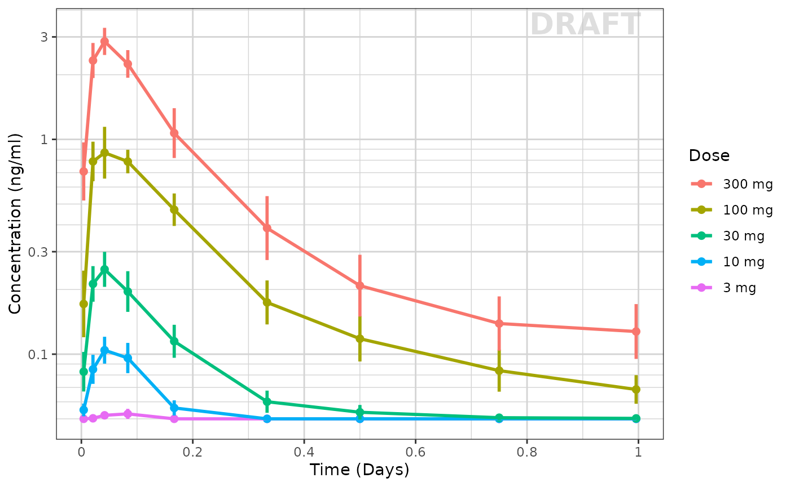

With this plot you see the mean concentrations confidence intervals
stratified by dose

### Concentration over time, faceted by Dose, mean +/- 95% CI, overlaid on gray spaghetti plots

Not only is it useful to look at the mean concentrations, it is often
useful to look at the mean concentrations and their relationship between
actual individual profiles. Using `ggplot` coupled with the `xgxr`
helper functions used above, we can easily create these plots as well:

``` r

ggplot(data = pk_data_cycle1, aes(x = TIME, y = LIDV)) +
  geom_line(aes(group = ID), color = "grey50", linewidth = 1, alpha = 0.3) +
  geom_cens(aes(cens=CENS)) + 
  xgx_geom_ci(aes(x = NOMTIME, color = NULL, group = NULL, shape = NULL), conf_level = 0.95) +
  xgx_scale_y_log10() +
  xgx_scale_x_time_units(units_dataset = time_units_dataset, units_plot = time_units_plot) +
  labs(y = conc_label, color = trtact_label) +
  theme(legend.position = "none") +
  facet_grid(.~TRTACT_low2high) +
  xgx_annotate_status(status)
```

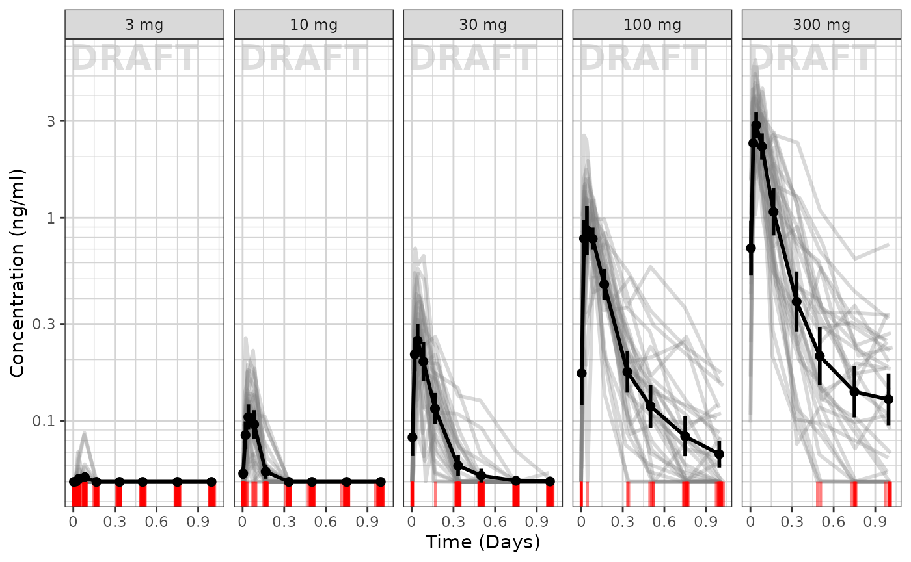

To me it appears the variability seems to be higher with higher doses
and higher with later times.

### Exploring the dose linearity

A common way to explore the dose linearity is to normalize by the dose.
If the confidence intervals overlap, often this is a dose linear
example.

``` r

ggplot(data = pk_data_cycle1,
       aes(x = NOMTIME,
           y = LIDV / as.numeric(as.character(DOSE)),
           group = DOSE,
           color = TRTACT_high2low)) +
  xgx_geom_ci(conf_level = 0.95, alpha = 0.5, position = position_dodge(1)) +
  xgx_scale_y_log10() +
  xgx_scale_x_time_units(units_dataset = time_units_dataset, units_plot = time_units_plot) +
  labs(y = concnorm_label, color = trtact_label) +
  xgx_annotate_status(status)
```

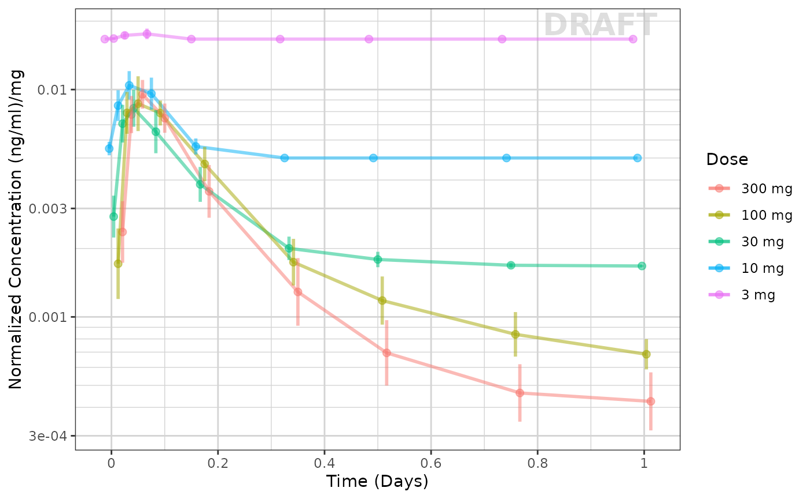

This example seems to be dose-linear, with the exception of the censored
data. This can be made even more clear by removing the censored data for
this plot:

``` r

ggplot(data = pk_data_cycle1 %>% filter(CENS == 0),
       aes(x = NOMTIME,
           y = LIDV / as.numeric(as.character(DOSE)),
           group = DOSE,
           color = TRTACT_high2low)) +
  xgx_geom_ci(conf_level = 0.95, alpha = 0.5, position = position_dodge(1)) +
  xgx_scale_y_log10() +
  xgx_scale_x_time_units(units_dataset = time_units_dataset, units_plot = time_units_plot) +
  labs(y = concnorm_label, color = trtact_label) +
  xgx_annotate_status(status)
```

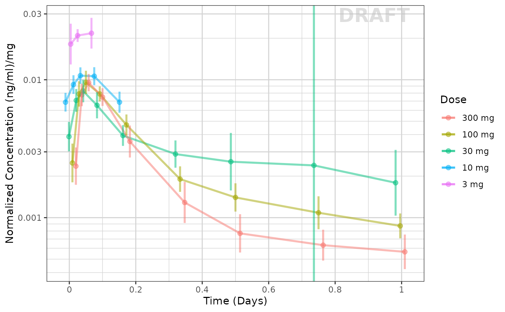

The lowest dose, with the most censoring, is the one that seems to be
the outlier. That is likely an artifact of censoring.

Other ways to explore the data include by looking at normalized Cmax and
AUC values (which we will skip in this vignette).

## Exploring Covariates in the dataset

Using the `xgx` helper functions to `ggplot` you can explore the effect
of high baseline weight. This particular plot is shown below:

``` r

ggplot(data = pk_data_cycle1, aes(x = NOMTIME,
                                  y = LIDV,
                                  group = WEIGHTB > 100,
                                  color = WEIGHTB > 100)) + 
    xgx_geom_ci(conf_level = 0.95) +
    xgx_scale_y_log10() +
    xgx_scale_x_time_units(units_dataset = time_units_dataset, units_plot = time_units_plot) +
    facet_grid(.~DOSE) +
    labs(y = conc_label, color = w100_label) +
    xgx_annotate_status(status)
```

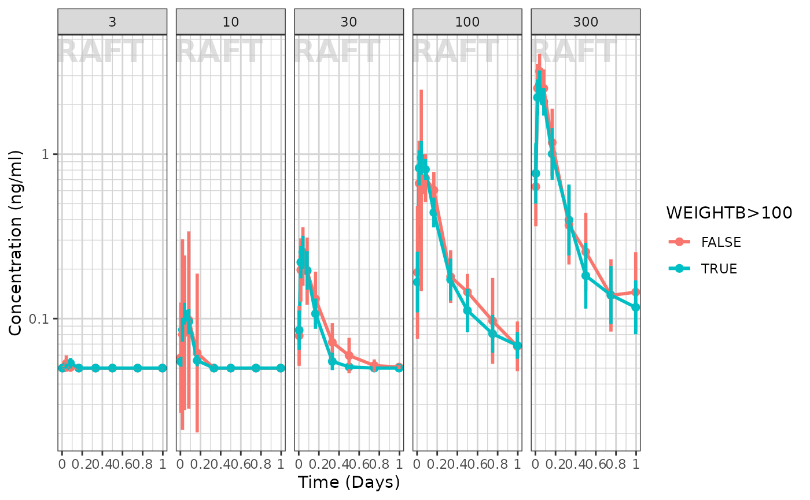

It seems that the weight effect is not extreme for either dose group

### Summary of exploratory analysis findings

From the exploratory analysis we see: - The doses seem proportional -
The PK seems to have a 2-compartment model - Censoring has a large
effect on the PK data.

## Fitting the data with nlmixr

First we need to subset to the PK only data and rename `LIDV` to `DV`

``` r

dat <-
  case1_pkpd %>%
  rename(DV=LIDV) %>%
  filter(CMT %in% 1:2) %>%
  filter(TRTACT != "Placebo")
```

For this demonstration we use all of the available subjects per dose
group (30 each):

``` r

doses <- unique(dat$DOSE)
nid <- 30 # subjects per dose group (all that are available)
dat2 <-
  dat %>%
  group_by(DOSE) %>%
  filter(ID %in% sort(unique(ID))[1:nid]) %>%
  ungroup()
```

While developing a base model you can subset to fewer subjects per dose
group (reduce `nid`) so a variety of structural models can be tried more
quickly, then apply the full dataset to the selected model.

Next create a 2 compartment model:

``` r

## Use 2 compartment model
cmt2 <- function() {
  ini({
    ## doses are in mg and concentrations in ng/mL, so the volumes are on
    ## the order of tens-to-hundreds of L; start there so the fit is stable
    lka <- log(0.5); label("Ka")
    lv <- log(50); label("Vc")
    lcl <- log(10); label("Cl")
    lq <- log(10); label("Q")
    lvp <- log(100); label("Vp")

    eta.ka ~ 0.1
    eta.v ~ 0.1
    eta.cl ~ 0.1
    logn.sd = 1
  })
  model({
    ka <- exp(lka + eta.ka)
    cl <- exp(lcl + eta.cl)
    v <- exp(lv + eta.v)
    q <- exp(lq)
    vp <- exp(lvp)
    linCmt() ~ lnorm(logn.sd)
  })
}

## Check parsing
cmt2m <- nlmixr(cmt2)
print(cmt2m)
#>  ── rxode2-based solved PK 2-compartment model ────────────────────────────────── 
#>  ── Initalization: ──  
#> Fixed Effects ($theta): 
#>        lka         lv        lcl         lq        lvp    logn.sd 
#> -0.6931472  3.9120230  2.3025851  2.3025851  4.6051702  1.0000000 
#> 
#> Omega ($omega): 
#>        eta.ka eta.v eta.cl
#> eta.ka    0.1   0.0    0.0
#> eta.v     0.0   0.1    0.0
#> eta.cl    0.0   0.0    0.1
#> 
#> States ($state or $stateDf): 
#>   Compartment Number Compartment Name Rate   Off Internal #
#> 1                  1            depot TRUE FALSE          1
#> 2                  2          central TRUE FALSE          2
#>  ── μ-referencing ($muRefTable): ──  
#>   theta    eta level
#> 1   lka eta.ka    id
#> 2   lcl eta.cl    id
#> 3    lv  eta.v    id
#> 
#>  ── Model (Normalized Syntax): ── 
#> function() {
#>     ini({
#>         lka <- -0.693147180559945
#>         label("Ka")
#>         lv <- 3.91202300542815
#>         label("Vc")
#>         lcl <- 2.30258509299405
#>         label("Cl")
#>         lq <- 2.30258509299405
#>         label("Q")
#>         lvp <- 4.60517018598809
#>         label("Vp")
#>         logn.sd <- c(0, 1)
#>         eta.ka ~ 0.1
#>         eta.v ~ 0.1
#>         eta.cl ~ 0.1
#>     })
#>     model({
#>         ka <- exp(lka + eta.ka)
#>         cl <- exp(lcl + eta.cl)
#>         v <- exp(lv + eta.v)
#>         q <- exp(lq)
#>         vp <- exp(lvp)
#>         linCmt() ~ lnorm(logn.sd)
#>     })
#> }
```

Now that the parsing of the nlmixr model is complete start and compare a
few models:

``` r

## First try log-normal (since the variability seemed proportional to concentration)
cmt2fit.logn := nlmixr(
  cmt2m, data = dat2,
  est = "saem",
  control=list(print=0),
  table=tableControl(cwres=TRUE, npde=TRUE)
)

## Now try proportional
cmt2fit.prop.mod <- cmt2fit.logn %>% update(linCmt() ~ prop(prop.sd))
cmt2fit.prop := nlmixr(
  cmt2fit.prop.mod, dat2,
  est="saem", control=list(print=0),
  table=tableControl(npde=TRUE, cwres=TRUE)
)
```

You could also try a combined additive-plus-proportional error, shown
below. It is not run here (`eval=FALSE`): for this data the additive
component collapses toward zero (the data is well described by a
proportional error alone), so the combined model is over-parameterized
and its covariance step does not produce a usable result.

``` r

## add+prop is over-parameterized here (additive component -> 0)
cmt2fit.add.prop <-
  cmt2fit.prop %>%
  update(linCmt() ~ prop(prop.sd) + add(add.sd)) %>%
  nlmixr(
    est="saem", control=list(print=0),
    table=tableControl(npde=TRUE, cwres=TRUE)
  )
```

Now that we have run the log-normal and proportional models, we can
compare the results side-by-side:

``` r

library(huxtable)

huxreg(
  "lognormal"=cmt2fit.logn,
  "proportional"=cmt2fit.prop,
  statistics=c(N="nobs", "logLik", "AIC"),
  stars = NULL
)
```

|  | lognormal | proportional |
|----|---:|---:|
| lka | -0.187  | 11.703  |
|  | (0.257) | (0.347) |
| lv | 3.457  | 5.172  |
|  | (0.303) | (0.097) |
| lcl | 2.599  | 170.184  |
|  | (0.041) | (0.025) |
| lq | 3.414  | -0.156  |
|  | (0.098) | (0.000) |
| lvp | 5.331  | 5.744  |
|  | (0.068) | (0.000) |
| sd\_\_eta.ka | 0.095  | 0.807  |
|  | (NA)      | (NA)      |
| sd\_\_eta.v | 0.110  | 0.327  |
|  | (NA)      | (NA)      |
| sd\_\_eta.cl | 0.440  | 0.289  |
|  | (NA)      | (NA)      |
| logn.sd | 1.117  |       |
|  | (0.014) |       |
| prop.sd |       | 13617079196587500107302926613860296318497129994858517739633993985271064424061213222451606964974700963682895776434231947392380091190828269413414731776.000  |
|  |       | (0.000) |
| N | 3900      | 3900      |
| logLik | 1391.792  | -71829.897  |
| AIC | -2765.584  | 143677.794  |

When comparing the objective functions of the log-normal and
proportional models, the proportional model has the lowest objective
function value. (Since we modeled log-normal without data transformation
it is appropriate to compare the AIC/Objective function values.)

## Model Diagnostics with ggPMX

``` r

## The controller then can be piped into a specific plot
ctr <- pmx_nlmixr(cmt2fit.logn, conts = "WEIGHTB", cats="TRTACT", vpc=TRUE)
#> [====|====|====|====|====|====|====|====|====|====] 0:00:02
```

``` r

ctr %>% pmx_plot_npde_pred()
```

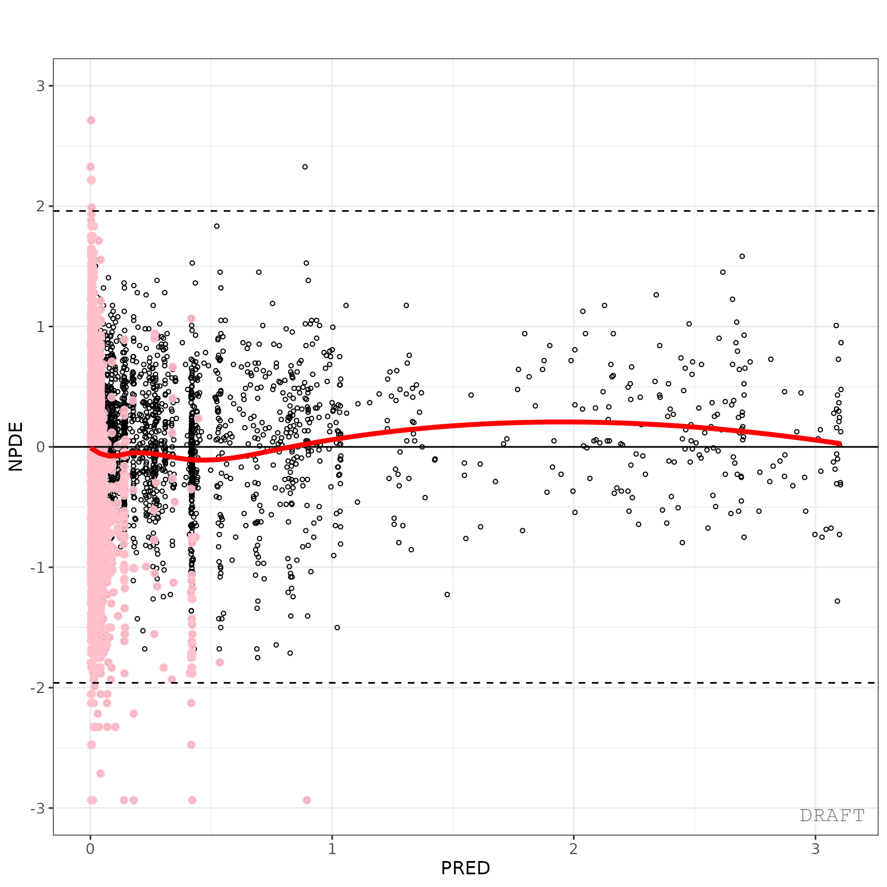

``` r

## Modify graphical options and remove DRAFT label:
ctr %>%
  pmx_plot_npde_time(
    smooth = list(color="blue"), point = list(shape=4), is.draft=FALSE, 
    labels = list(x = "Time after first dose (days)", y = "Normalized PDE")
  )
```

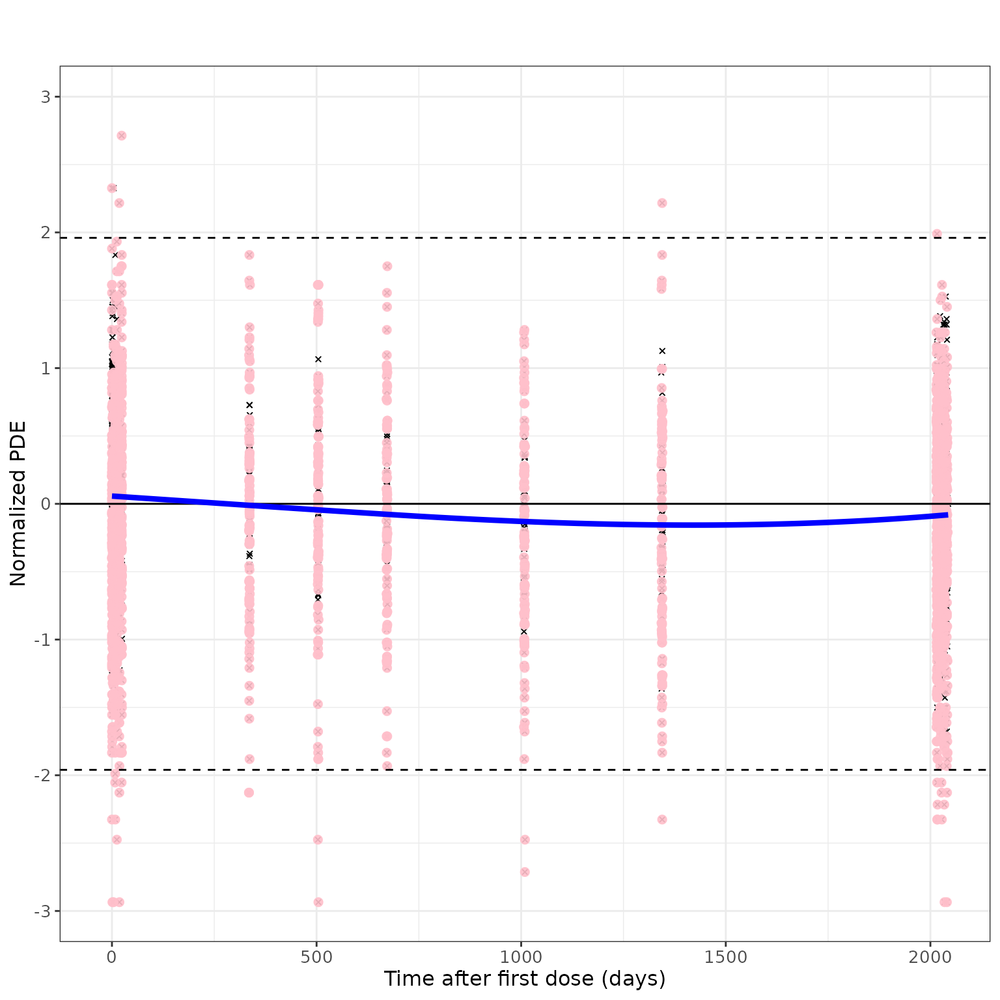

``` r

ctr %>% pmx_plot_dv_ipred(scale_x_log10=TRUE, scale_y_log10=TRUE, filter=IPRED>0.001)
```

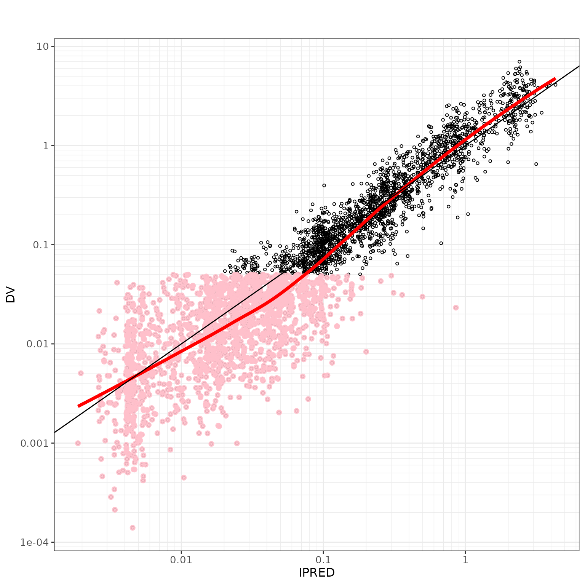

``` r

ctr %>% pmx_plot_dv_pred(scale_x_log10=TRUE, scale_y_log10=TRUE, filter=IPRED>0.001)
```

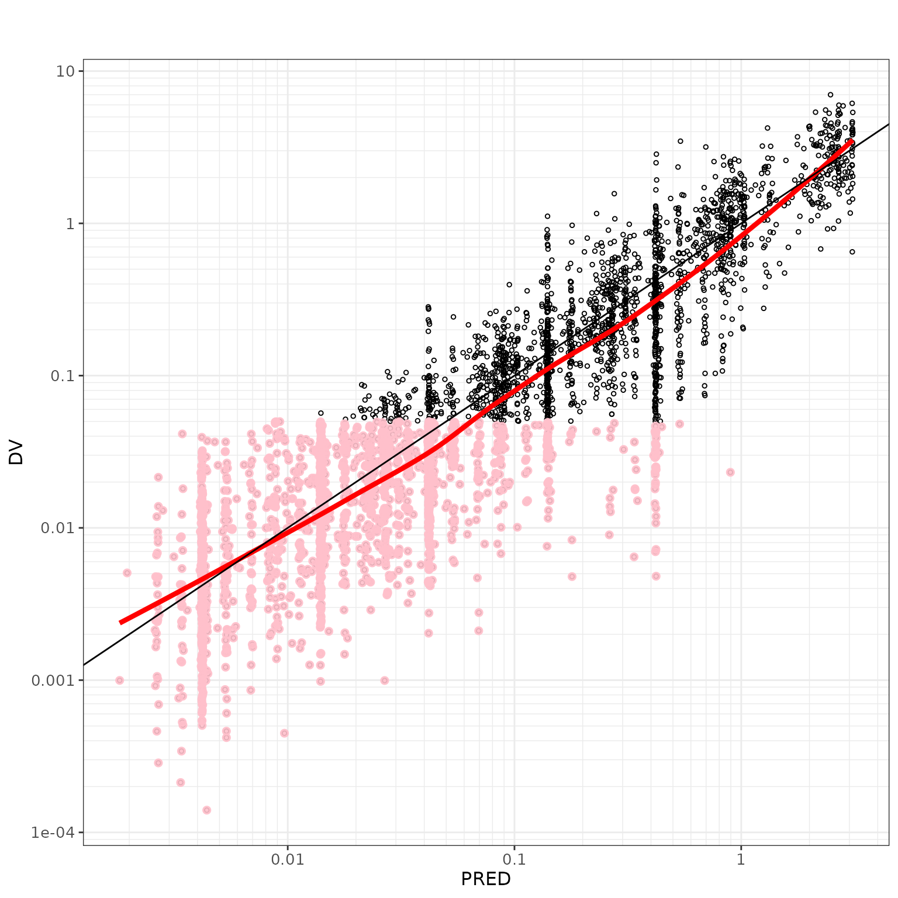

``` r

ctr %>% pmx_plot_abs_iwres_ipred()
```

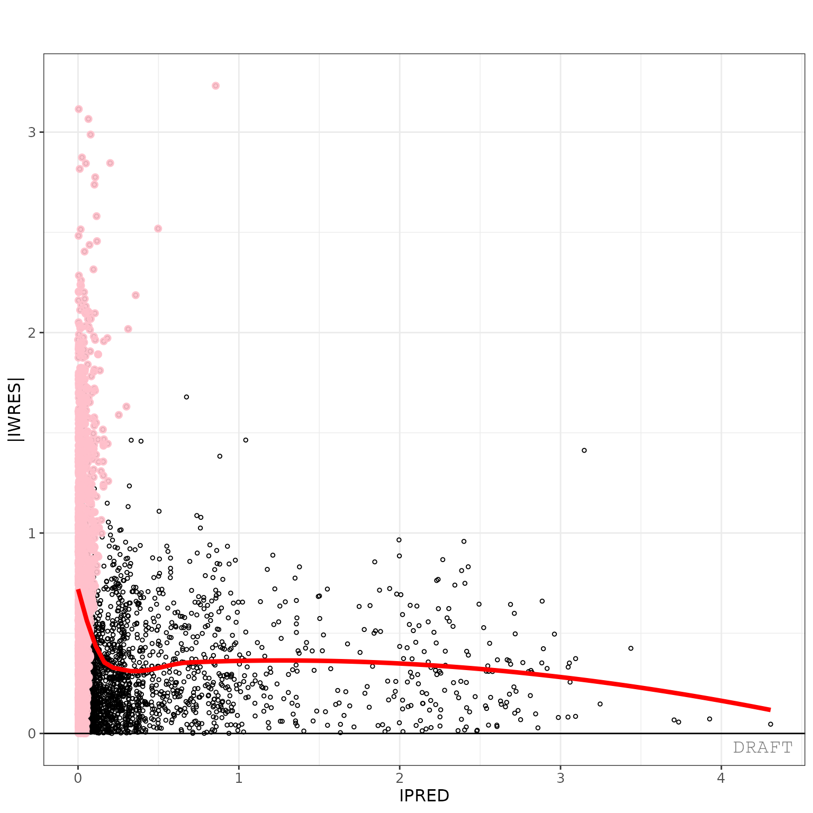

``` r

ctr %>%
  pmx_plot_individual(
    1,
    filter= TIME > 0 & TIME < 48,
    facets = list(nrow = 2, ncol = 2)
  )
```

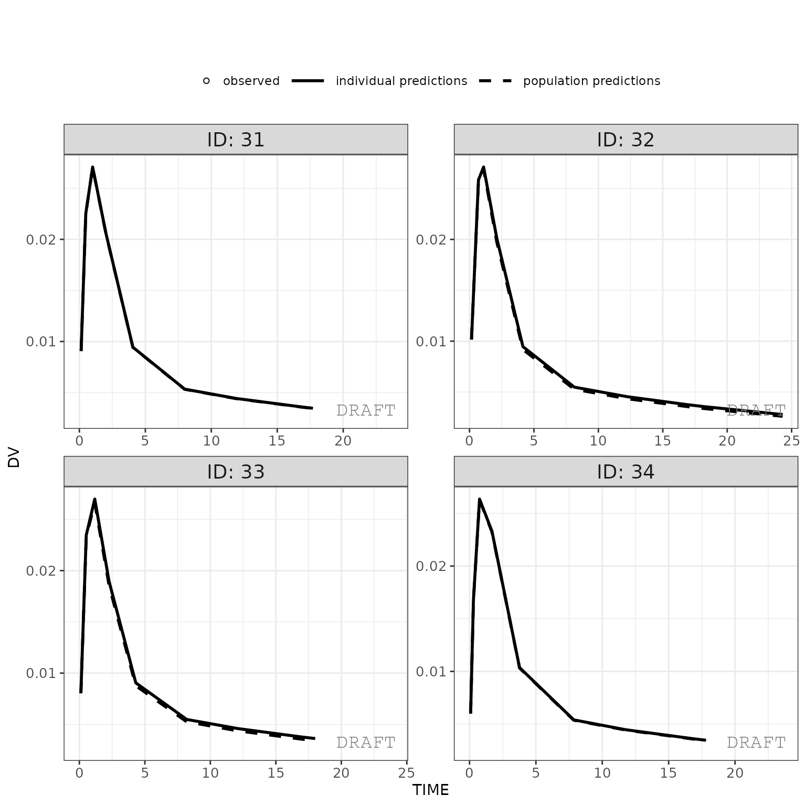

``` r

ctr %>% pmx_plot_iwres_dens()
```

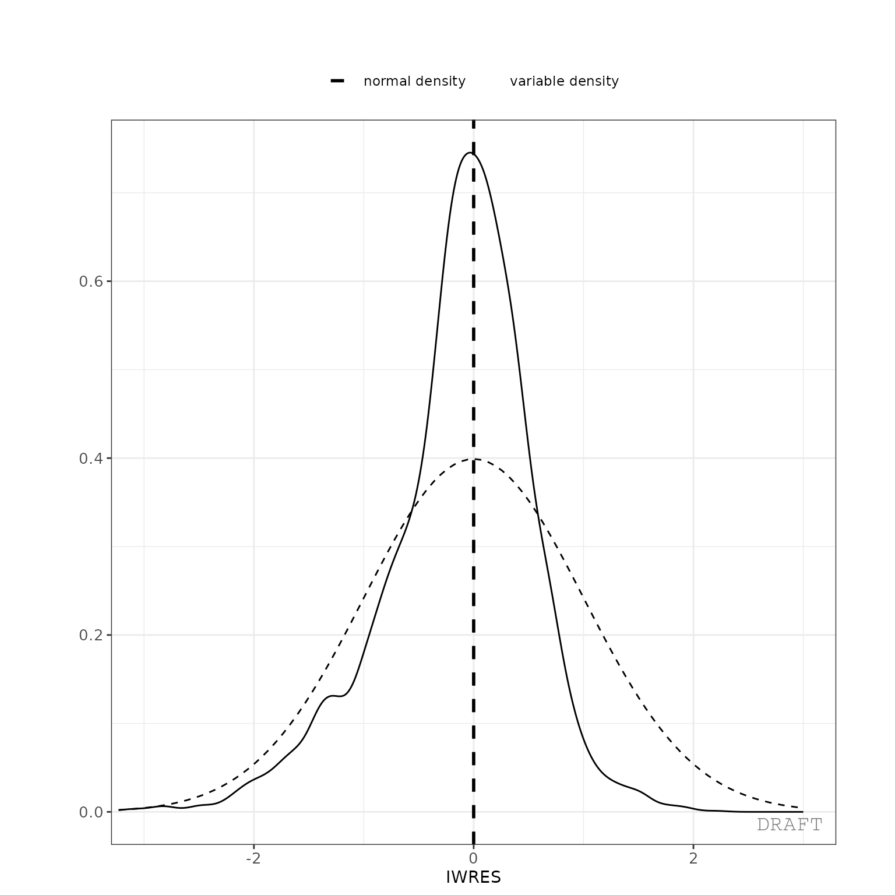

``` r

ctr %>% pmx_plot_eta_qq()
```

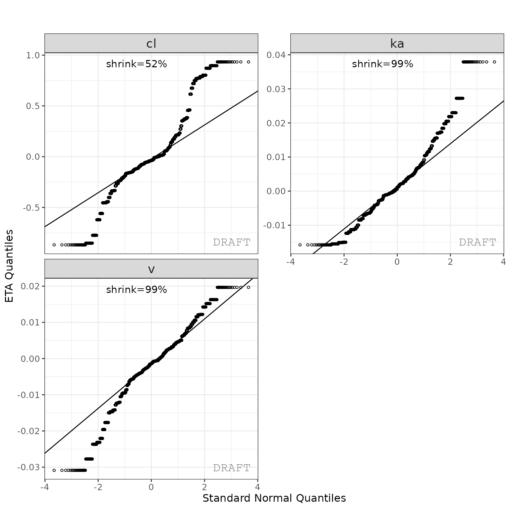

This creates two reports with default settings, both a
[pdf](https://github.com/nlmixr2/nlmixr2/raw/master/vignettes/nlmixr_report.pdf)
and
[word](https://github.com/nlmixr2/nlmixr2/raw/master/vignettes/nlmixr_report.docx)
document. The report can be customized by editing the default template
to include project specificities (change labels, stratifications,
filtering, etc.).

``` r

ctr %>% pmx_plot_eta_box()
```

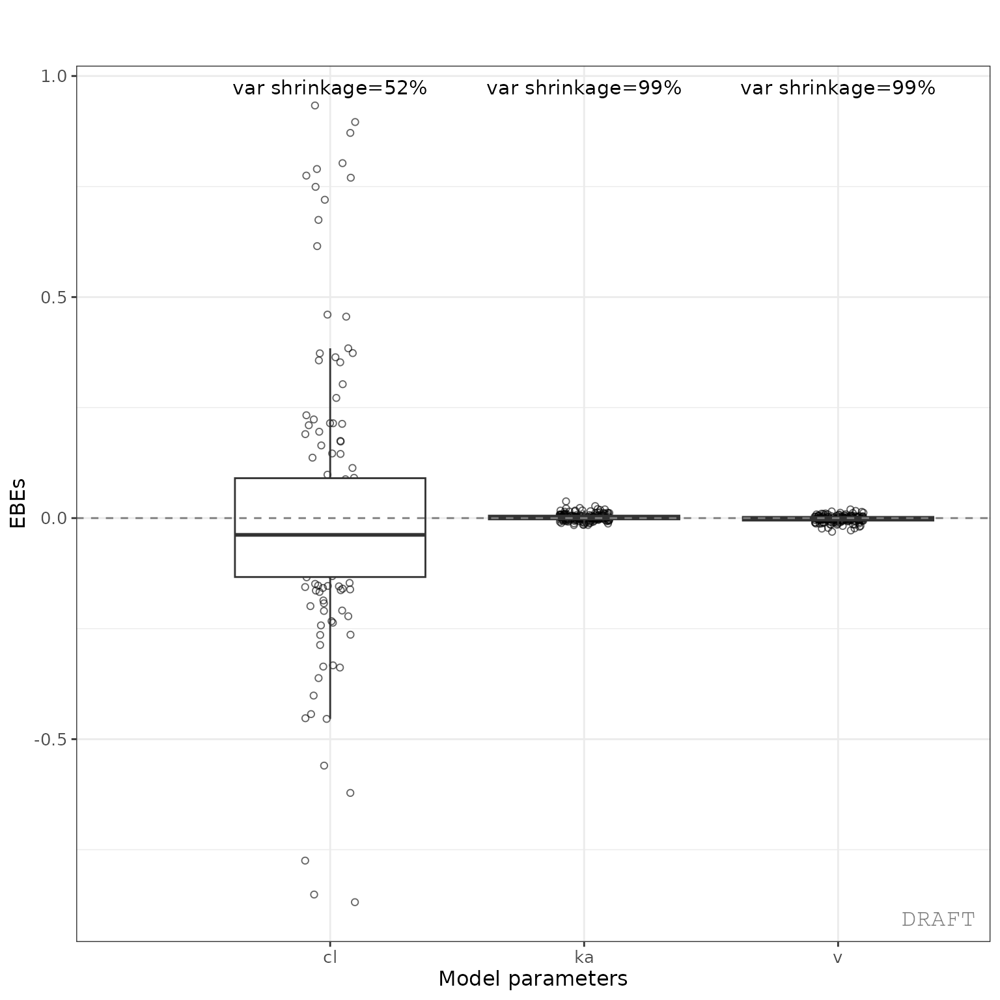

``` r

ctr %>% pmx_plot_eta_hist()
```

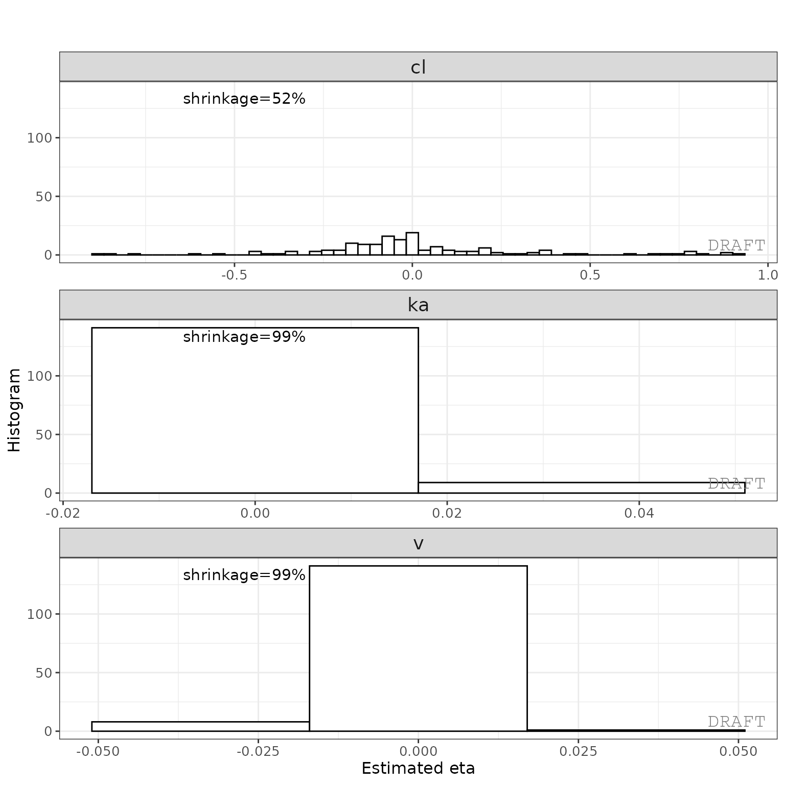

``` r

ctr %>% pmx_plot_eta_matrix()
```

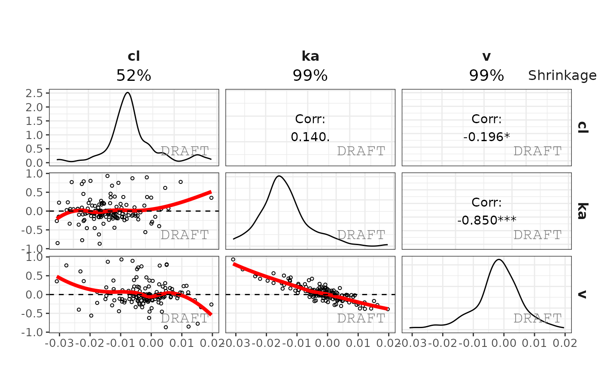

This creates two reports with default settings, both a
[pdf](https://github.com/nlmixr2/nlmixr2/raw/master/vignettes/nlmixr_report.pdf)
and
[word](https://github.com/nlmixr2/nlmixr2/raw/master/vignettes/nlmixr_report.docx)
document. The report can be customized by editing the default template
to include project specifics (change labels, stratification, filtering,
etc.).

## Simulation of a new scenario with `rxode2`

By creating events you can simply simulate a new scenario. Perhaps your
drug development team wants to explore the 100 mg dose 3 times a day
dosing to see what happens with the PK. You can simply simulate from the
nlmixr model using a [new event
table](https://nlmixr2.github.io/rxode2/articles/rxode2-event-table.html)
created from
[`rxode2()`](https://nlmixr2.github.io/rxode2/reference/rxode2.html).

In this case we wish to simulate with some variability and see what
happens at steady state:

``` r

# Start a new simulation
ev <- et(amt=100, ii=8, ss=1)
```

``` r

ev$add.sampling(seq(0, 8, length.out=50))
print(ev)
#> ── EventTable with 51 records ──
#> 1 dosing records (see $get.dosing(); add with add.dosing or et)
#> 50 observation times (see $get.sampling(); add with add.sampling or et)
#> ── First part of : ──
#> # A tibble: 51 × 5
#>     time   amt    ii evid             ss
#>    <dbl> <dbl> <dbl> <evid>        <int>
#>  1 0       100     8 1:Dose (Add)      1
#>  2 0        NA    NA 0:Observation    NA
#>  3 0.163    NA    NA 0:Observation    NA
#>  4 0.327    NA    NA 0:Observation    NA
#>  5 0.490    NA    NA 0:Observation    NA
#>  6 0.653    NA    NA 0:Observation    NA
#>  7 0.816    NA    NA 0:Observation    NA
#>  8 0.980    NA    NA 0:Observation    NA
#>  9 1.14     NA    NA 0:Observation    NA
#> 10 1.31     NA    NA 0:Observation    NA
#> # ℹ 41 more rows
```

An nlmixr model already includes information about the parameter
estimates and can simulate without uncertainty in the population
parameters or covariances, like what is done for a VPC.

If you wish to simulate `100` patients repeated by `100` different
theoretical studies where you simulate from the uncertainty in the fixed
parameter estimates and covariances you can very easily with
nlmixr2/rxode2:

``` r

set.seed(100)
sim1 <- rxSolve(cmt2fit.logn, ev, nSub=100, nStud=100)
#> [====|====|====|====|====|====|====|====|====|====
print(sim1)
#> ── Solved rxode2 object ──
#> ── Parameters ($params): ──
#> # A tibble: 10,000 × 10
#>    sim.id    lka    lv   lcl    lq   lvp logn.sd  eta.ka    eta.v    eta.cl
#>     <int>  <dbl> <dbl> <dbl> <dbl> <dbl>   <dbl>   <dbl>    <dbl>     <dbl>
#>  1      1 -0.431  3.15  2.59  3.32  5.34    1.12  0.0101 -0.00522 -0.464   
#>  2      2 -0.431  3.15  2.59  3.32  5.34    1.12  0.169  -0.0481  -0.435   
#>  3      3 -0.431  3.15  2.59  3.32  5.34    1.12  0.136   0.122   -0.00136 
#>  4      4 -0.431  3.15  2.59  3.32  5.34    1.12 -0.0403  0.00707  0.229   
#>  5      5 -0.431  3.15  2.59  3.32  5.34    1.12  0.220  -0.125    0.000424
#>  6      6 -0.431  3.15  2.59  3.32  5.34    1.12  0.144   0.0718  -0.200   
#>  7      7 -0.431  3.15  2.59  3.32  5.34    1.12 -0.0418 -0.0354  -0.579   
#>  8      8 -0.431  3.15  2.59  3.32  5.34    1.12 -0.0573 -0.288   -0.133   
#>  9      9 -0.431  3.15  2.59  3.32  5.34    1.12 -0.0102  0.105    0.170   
#> 10     10 -0.431  3.15  2.59  3.32  5.34    1.12  0.147  -0.0575  -0.0183  
#> # ℹ 9,990 more rows
#> ── Initial Conditions ($inits): ──
#>       depot     central peripheral1 
#>           0           0           0 
#> 
#> Simulation with uncertainty in:
#> • parameters ($thetaMat for changes)
#> • omega matrix ($omegaList)
#> • sigma matrix ($sigmaList)
#> 
#> ── First part of data (object): ──
#> # A tibble: 500,000 × 12
#>   sim.id  time    ka    cl     v     q    vp ipredSim    sim depot central
#>    <int> <dbl> <dbl> <dbl> <dbl> <dbl> <dbl>    <dbl>  <dbl> <dbl>   <dbl>
#> 1      1 0     0.657  8.37  23.2  27.5  209.     1.12  1.76  101.     25.9
#> 2      1 0.163 0.657  8.37  23.2  27.5  209.     1.50  0.667  90.3    34.7
#> 3      1 0.327 0.657  8.37  23.2  27.5  209.     1.75  6.17   81.1    40.7
#> 4      1 0.490 0.657  8.37  23.2  27.5  209.     1.92 18.6    72.9    44.5
#> 5      1 0.653 0.657  8.37  23.2  27.5  209.     2.02  0.514  65.5    46.8
#> 6      1 0.816 0.657  8.37  23.2  27.5  209.     2.06  1.07   58.8    47.9
#> # ℹ 499,994 more rows
#> # ℹ 1 more variable: peripheral1 <dbl>
```

You may examine the simulated study information easily, as show in the
[`rxode2()`](https://nlmixr2.github.io/rxode2/reference/rxode2.html)
printout:

``` r

head(sim1$thetaMat)
#>              lka         lv          lcl          lq         lvp      logn.sd
#> [1,] -0.24310499 -0.3069419 -0.009243328 -0.09784732  0.01242648  0.005394559
#> [2,] -0.18784810 -0.2623023 -0.039100147  0.07996672  0.01376370  0.003423098
#> [3,]  0.08075177  0.1022470  0.011021375 -0.02801452  0.04737219 -0.008515521
#> [4,] -0.13312090 -0.2126346 -0.065836851 -0.05694813 -0.03591474 -0.013095814
#> [5,] -0.17585009 -0.1394264 -0.106183413 -0.18323328 -0.01257307  0.022512342
#> [6,]  0.36172057  0.4628480  0.062899895  0.08703887  0.00156359  0.001694008
```

You can also see the covariance matricies that are simulated (note they
come from an inverse Wishart distribution):

``` r

head(sim1$omegaList)
#> [[1]]
#>               eta.ka         eta.v       eta.cl
#> eta.ka  0.0097386012 -0.0009766941 -0.001299979
#> eta.v  -0.0009766941  0.0148086539  0.002559209
#> eta.cl -0.0012999793  0.0025592095  0.195150912
#> 
#> [[2]]
#>               eta.ka         eta.v       eta.cl
#> eta.ka  0.0084458971 -0.0005014409 -0.002246153
#> eta.v  -0.0005014409  0.0135118622  0.003784047
#> eta.cl -0.0022461527  0.0037840471  0.185596834
#> 
#> [[3]]
#>              eta.ka         eta.v       eta.cl
#> eta.ka 0.0080249125  0.0002111766  0.002587580
#> eta.v  0.0002111766  0.0135033706 -0.009131818
#> eta.cl 0.0025875804 -0.0091318182  0.186541471
#> 
#> [[4]]
#>              eta.ka        eta.v      eta.cl
#> eta.ka 9.608690e-03 4.361314e-05 0.001587391
#> eta.v  4.361314e-05 1.099009e-02 0.002838064
#> eta.cl 1.587391e-03 2.838064e-03 0.172858719
#> 
#> [[5]]
#>               eta.ka        eta.v       eta.cl
#> eta.ka  0.0098398893 0.0008144681 -0.001500053
#> eta.v   0.0008144681 0.0140092814  0.001514191
#> eta.cl -0.0015000529 0.0015141913  0.189391288
#> 
#> [[6]]
#>              eta.ka        eta.v       eta.cl
#> eta.ka  0.009532787 -0.001736875 -0.003261606
#> eta.v  -0.001736875  0.012642187  0.005263468
#> eta.cl -0.003261606  0.005263468  0.190687544
```

``` r

head(sim1$sigmaList)
#> [[1]]
#>                rxerr.rxLinCmt
#> rxerr.rxLinCmt      0.9926866
#> 
#> [[2]]
#>                rxerr.rxLinCmt
#> rxerr.rxLinCmt       1.023488
#> 
#> [[3]]
#>                rxerr.rxLinCmt
#> rxerr.rxLinCmt       1.013763
#> 
#> [[4]]
#>                rxerr.rxLinCmt
#> rxerr.rxLinCmt       1.019769
#> 
#> [[5]]
#>                rxerr.rxLinCmt
#> rxerr.rxLinCmt      0.9784425
#> 
#> [[6]]
#>                rxerr.rxLinCmt
#> rxerr.rxLinCmt        1.02093
```

It is also easy enough to create a plot to see what is going on with the
simulation:

``` r

conf <- confint(sim1, "sim")

p1 <- plot(conf) ## This returns a ggplot2 object

## you can tweak the plot by the standard ggplot commands
p1 +
  xlab("Time (hr)") + 
  ylab("Simulated Concentrations of TID steady state")
```

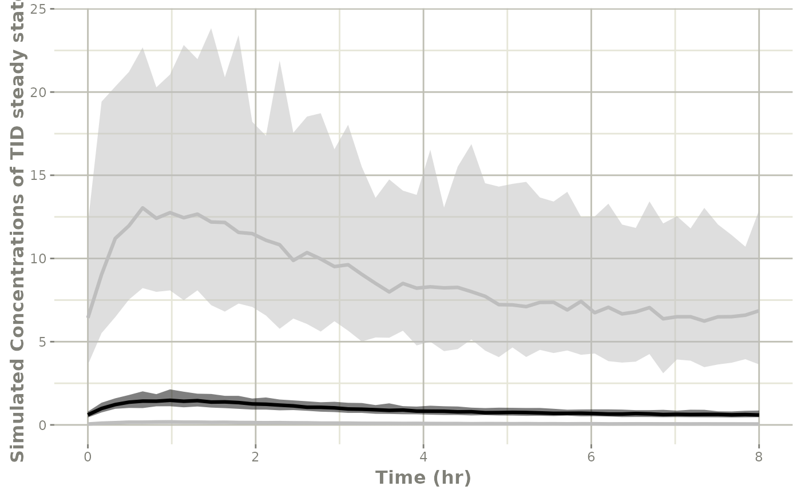

``` r


# And put the same plot on a semi-log plot
p1 +
  xlab("Time (hr)") + 
  ylab("Simulated Concentrations of TID steady state") +
  xgx_scale_y_log10()
```

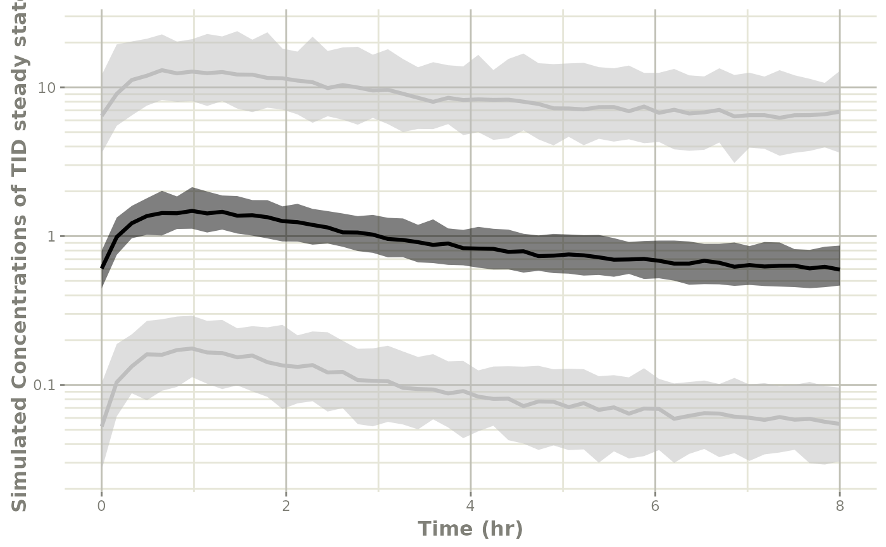

For more complex simulations with variability you can also [simulate
dosing windows and sampling
windows](https://nlmixr2.github.io/rxode2/articles/rxode2-event-table.html#add-doses-and-samples-within-a-sampling-window)
and use any tool you want to summarize it in the way you wish.
